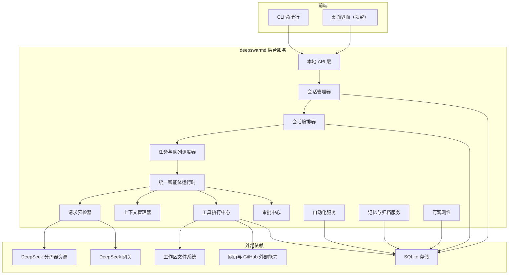
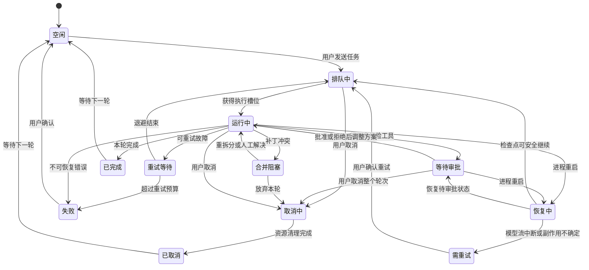
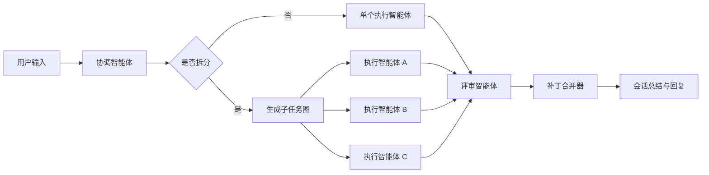

# DeepSwarm Agent 设计文档

## 1. 文档目标

本文定义一个面向 DeepSwarm 的 Agent(智能体) 实现方案，范围只覆盖：

- 只接入 DeepSeek(深度求索) 模型，不做多模型路由
- DeepSeek 接入以 [DeepSeekAPI完整开发手册-官方文档只读.md](D:/code/git_code/ai/DeepSwarm/DeepSwarm_main/docs/DeepSeekAPI完整开发手册-官方文档只读.md) 的官方稳定调用规范为准
- 每次模型请求发送前必须先计算 token(令牌) 数量
- 代码实现语言固定为 Rust(编程语言)
- 首版只实现命令行界面，桌面界面只预留接入位
- 支持项目下多会话
- 支持单会话多智能体协作
- 支持海量并发，目标为约 3000 个并发会话
- 覆盖现有工具清单、审批、上下文预算、自动保存与恢复

本文刻意不做以下内容：

- 不设计多云、多模型、多供应商切换
- 不设计分布式集群版调度
- 不设计插件市场或复杂扩展框架
- 不把 GitHub、网页、自动化做成独立子平台
- 不接入 DeepSeek Beta(测试版) 地址、Anthropic(人机对话接口) 兼容接口、Prefix(前缀续写) 和 FIM(中间填充) 补全
- 不在首版实现桌面界面，只保留本地 API(应用程序接口) 与事件流预留
- 不在首版锁定桌面技术栈，待 CLI(命令行界面) 方案稳定后再选择

结论先行：首版最合适的形态不是“每个前端自己跑一套 Agent”，而是一个本地后台服务 `deepswarmd` 作为唯一运行时；CLI(命令行界面) 先接入，桌面界面只保留未来客户端接入位。

本文对版本范围作如下统一定义：

- Phase 1 是 MVP(最小可行产品)，只证明“后台服务 + CLI + DeepSeek 流式对话 + token 预检 + 基础审批 + 持久化”闭环可运行
- Phase 2 和 Phase 3 分别补齐工具恢复能力与单会话多智能体，不单独宣称达到 3000 并发目标
- Phase 4 通过容量测试后，才视为本文所称“首版”完整交付
- Phase 5 只是桌面接入预留，不属于首版实现范围

## 2. 设计目标与非目标

### 2.1 设计目标

1. 一个项目下可以创建、切换、恢复多个会话。
2. 一个会话可以在需要时拉起多个智能体并行完成子任务。
3. 3000 个会话同时存在并在短时间内提交任务时，系统仍可稳定保存状态、切换会话、接收请求和排队执行；不要求同时占用 3000 条模型流。
4. 对用户保持连续多轮对话体验，首版以 CLI 为主，支持流式输出、取消、审批、历史回放。
5. 工具层统一封装，避免每类工具各写一套执行框架。
6. 只围绕 DeepSeek 做能力和限流设计，减少抽象层浪费。

### 2.2 非目标

1. 不承诺 3000 个会话同时各自占用一个模型流。
2. 不在首版实现跨机器调度。
3. 不在首版实现复杂长期学习，只保留项目记忆、会话摘要和归档回忆。
4. 不为不同角色智能体分别实现完全不同的运行时，只保留统一运行时和角色配置。
5. 不在首版实现桌面 UI(用户界面)，仅保证 API 与事件流可供后续桌面端复用。

## 3. 核心设计结论

### 3.1 一句话方案

采用“单后台服务 + 会话 Actor(参与者模型) + 统一 Agent Runtime(智能体运行时) + DeepSeek 请求代理 + 工具执行沙箱”的结构。

### 3.2 关键决策

1. `deepswarmd` 是唯一状态中心。
2. Session(会话) 是系统一级对象，Agent(智能体) 是会话内部的执行单元，不直接暴露给前端。
3. 3000 并发的关键不是 3000 个线程，而是 3000 个轻量会话状态机加少量真实活跃执行槽。
4. 单会话多智能体通过“计划拆分 + 补丁合并”实现，不让多个智能体直接同时写主工作目录。
5. DeepSeek 接入只做一个 `DeepSeekGateway`，统一处理流式输出、函数调用、重试、限流、计费与熔断。
6. 持久化优先使用 SQLite(轻量数据库) + 文件存储，不引入额外基础设施。
7. DeepSeek 只走官方稳定 OpenAI(开放人工智能) 兼容接口 `https://api.deepseek.com`，不依赖 `/beta` 或兼容层。
8. 每次请求前必须先用本地分词器预估输入 token，再决定是否压缩上下文或下调输出预算。
9. 全部工程代码用 Rust 编写，命名遵循主流 Rust 约定。

## 4. 总体架构



### 4.1 为什么要拆成后台服务

如果 CLI 和未来桌面界面各自维护会话、模型连接、运行中的进程，会马上出现三类问题：

- 同一项目的会话历史无法共享
- 桌面端无法接管 CLI 正在跑的任务
- 3000 并发时状态会散落在多个进程里，无法统一限流和恢复

因此首版必须共享一个后台服务。

## 5. 核心对象模型

### 5.1 对象层级

```text
Project(项目)
└── Session(会话)
    ├── Turn(用户轮次)
    ├── AgentGroup(本轮智能体组)
    │   ├── CoordinatorAgent(协调智能体)
    │   ├── WorkerAgent(n)
    │   └── ReviewerAgent(n)
    ├── ToolRun(工具执行记录)
    ├── ApprovalRequest(审批请求)
    ├── Artifact(产物)
    └── SessionMemory(会话摘要与归档)
```

### 5.2 关键实体

| 实体 | 作用 | 关键字段 |
|---|---|---|
| `Project` | 项目级隔离边界 | `id`、`name`、`root_path`、`default_model_profile` |
| `Session` | 多轮对话与执行载体 | `id`、`project_id`、`title`、`cwd`、`state`、`model_profile` |
| `Turn` | 一次用户输入及其执行过程 | `id`、`session_id`、`input`、`status`、`started_at` |
| `AgentRun` | 单个智能体实例的生命周期 | `id`、`session_id`、`role`、`task_id`、`state` |
| `TaskNode` | 会话内拆分出的子任务 | `id`、`turn_id`、`depends_on`、`status`、`base_revision`、`read_scope`、`write_scope` |
| `ToolRun` | 一次工具调用记录 | `id`、`tool_name`、`risk_level`、`status`、`output_ref` |
| `ApprovalRequest` | 高风险操作审批单 | `id`、`scope`、`decision`、`expires_at` |
| `Artifact` | 代码补丁、摘要、日志、测试结果 | `id`、`type`、`uri`、`session_id` |

### 5.3 会话状态机



状态转换约束：

- `cancel` 请求必须幂等；进入 `取消中` 后不得再启动新的模型请求或工具副作用
- 审批拒绝默认只拒绝当前工具调用，并把结构化拒绝结果交给当前 Agent 调整方案；只有用户明确取消或已无替代方案时才终止 Turn(轮次)
- `需重试`、`合并阻塞`、`失败` 都是用户可见状态，不得继续显示为“运行中”

## 6. 多会话设计

### 6.1 多会话隔离原则

每个会话必须独立保存以下内容：

- 会话名称
- 当前工作目录
- DeepSeek 模型配置
- 消息记录
- 工具执行结果
- 审批决策
- 运行中任务与检查点
- 会话摘要和上下文预算状态

### 6.2 会话不是线程

3000 并发会话下，不为每个会话创建常驻线程。每个会话只保留：

- 一份轻量状态对象
- 一个异步消息队列
- 若干持久化索引

只有在会话进入活跃执行时，才分配真实资源：

- 模型流槽位
- 工具进程槽位
- 智能体执行槽位

### 6.3 会话优先级

会话调度采用三层优先级：

1. 前台交互会话：用户当前正在看的会话
2. 前台后台混合会话：用户刚发起但已切走的会话
3. 纯后台会话：自动化、批处理、低优先级回顾任务

这样可以保证当前前台交互会话总能先得到资源；未来桌面端接入后也复用同一优先级机制。

## 7. 单会话多智能体设计

### 7.1 角色最小化

单会话多智能体只保留 4 类角色：

| 角色 | 作用 |
|---|---|
| `Coordinator` | 读懂用户目标，决定是否拆分子任务 |
| `Worker` | 执行具体编码、搜索、测试、编辑 |
| `Reviewer` | 审查补丁、测试结果和风险 |
| `Summarizer` | 在上下文过长时整理摘要 |

首版不为每个角色单独写一套运行时，只做一个 `AgentRuntime`，用 `role_profile` 切换提示词、工具集和预算。

### 7.2 拆分策略

`Coordinator` 每轮先判断任务复杂度：

1. 简单问答或单文件小改动：不拆分，单智能体直跑
2. 多文件但强依赖任务：串行拆分，最多 2 到 3 个 worker
3. 相对独立的子任务：并行拆分，交给多个 worker
4. 需要质量把关：在 worker 后挂 reviewer

每个可写 `TaskNode` 必须在执行前声明 `write_scope`：

- 多个任务写范围重叠或无法确定时，直接串行执行
- 补丁超出声明写范围时拒绝合并，并交回 `Coordinator` 重新调度
- 只读任务不创建独立工作目录，也不占用写入合并槽位

### 7.3 写冲突处理

为避免多个智能体同时改主工作目录，逻辑层采用“主工作区 + 智能体补丁层”，合并引擎使用 Git(版本控制) 三路合并：

1. `Worker` 基于 `base_revision` 和声明的 `write_scope` 读取代码并产出补丁
2. 需要运行构建命令、修改依赖、处理重命名或预测为高冲突的写任务，使用临时 detached worktree(游离工作树)；低冲突文本修改继续使用轻量临时目录
3. 运行时记录补丁内容、受影响文件集合、`base_revision` 和临时工作目录标识
4. `Reviewer` 或 `Coordinator` 审查补丁后，`PatchMerger` 在独立 merge workspace(合并工作区) 中依次执行 `git apply --check` 和 `git apply --3way`
5. 同一 Turn 的已批准补丁先全部汇总到 merge workspace，全部合并和测试通过后才一次性写回主工作区；任一补丁阻塞时，不得把该 Turn 的部分结果提前写回
6. 普通文本冲突可在最新 head(头提交) 上自动重试 1 次
7. 若仍失败，则把相关任务标记为 `merge_blocked`，并触发以下兜底链：
   - 同文件冲突任务转为串行执行
   - 必要时把冲突任务退回 `Coordinator` 重新拆分
   - 连续失败则升级为人工介入或取消本次 Turn 未写回的合并批次

额外约束：

- `add/add`、`modify/delete`、文件重命名、跨文件大重构、依赖清单和锁文件变更属于结构冲突，不做盲目自动重试，默认进入 exclusive scope(排他范围)
- 不采用“每个 Agent 一个常驻完整 worktree(独立工作树)”；临时 worktree 只服务需要独立文件树的可写任务，并在完成、取消和恢复清理阶段删除
- 非 Git 项目不启用并行写，退化为单 `Worker` 串行修改
- 最终写回前再次检查主工作区 revision(修订版本) 和未提交变更；主工作区已经变化时进入 `merge_blocked`，不得覆盖用户改动
- 补丁合并成功率要按任务类型单独统计，不能只看整体平均值

### 7.4 单会话执行流



### 7.5 单会话智能体数量上限

为了避免一个会话抢走全部资源，单会话设硬上限：

- 默认最多 6 个活跃智能体
- 前台会话可提升到 8 个
- 后台会话通常限制为 2 到 4 个

这个限制比“理论上无限拉起智能体”更符合真实资源约束。

## 8. 3000 并发设计

### 8.1 并发目标的正确解释

“支持约 3000 个并发”在本方案里的定义是：

- 允许约 3000 个会话同时存在并被快速切换、恢复、排队和继续执行
- 允许这 3000 个会话在 60 秒窗口内集中提交任务，后台必须完整接收并进入明确状态
- 允许其中一部分会话处于热状态并实时流式输出
- 不要求 3000 个会话同时都占用 DeepSeek 的活跃流连接

真正稀缺的资源是：

- DeepSeek 模型请求并发
- Shell/后台进程并发
- 文件写入并发
- 审批等待中的前端连接数

其中 DeepSeek 官方当前账号并发上限为：

- `deepseek-v4-flash`：2500
- `deepseek-v4-pro`：500

因此 3000 会话设计不能等价理解为 3000 条同时活跃模型流。

### 8.2 并发分层

| 层级 | 数量目标 | 说明 |
|---|---|---|
| 常驻会话对象 | 3000 | 轻量状态机，常驻内存或热缓存 |
| 热会话 | 100 到 300 | 最近活跃、有流式输出或工具执行 |
| 活跃模型流 | 64 到 256 | 默认低于官方并发上限，按模型类型分开限流 |
| 活跃工具进程 | 64 到 128 | 受 CPU、磁盘、系统进程数限制 |
| 单会话活跃智能体 | 1 到 8 | 受会话级配额限制 |

### 8.3 调度模型

采用“事件驱动 + 加权公平队列”：

1. 会话收到新输入、工具完成、审批通过、取消请求时产生事件
2. 调度器只处理有事件的会话，不轮询全部会话
3. 所有模型请求进入全局队列
4. 前台交互请求权重大于后台总结和自动化请求
5. 同一会话有最大并发占比，避免饿死其它会话

实现基石选择：

- 首版使用 Tokio(异步运行时) 多线程运行时
- 不引入 Actix 或 ractor 等额外 Actor 框架，先用 `tokio::task` + `mpsc` + `Semaphore` + `Notify` 组合完成
- 热会话采用“每会话一个 mailbox(邮箱) + 一个持有状态的任务”模型
- 冷会话不常驻 Tokio task(任务)，只在内存里保留轻量索引，完整状态按需从 SQLite 载入
- 避免把 `Arc<Mutex<SessionState>>` 作为主状态模型；会话状态优先由单个任务独占，跨会话共享数据才进入并发容器

建议的并发原语：

- 会话邮箱：`tokio::sync::mpsc`
- 模型并发槽位：`tokio::sync::Semaphore`
- 会话唤醒：`tokio::sync::Notify`
- 会话索引：`DashMap<SessionId, SessionMeta>`
- 全局配置：`Arc<Config>`

### 8.4 容量估算

3000 会话不代表 3000 个活跃 Tokio task。首版按以下粗估控制面资源设计：

| 项目 | 估算 |
|---|---|
| 冷会话元数据 | 8 到 16 KB/会话，3000 会话约 24 到 48 MB |
| 热会话缓存状态 | 128 到 512 KB/会话，300 会话约 38 到 150 MB |
| 调度队列与索引 | 30 到 80 MB |
| 控制面稳态内存目标 | 不含工具输出缓存与子进程时，小于 512 MB |
| 建议起步机器 | 8 vCPU、16 GB RAM |

说明：

- 大工具输出、网页抓取结果、补丁正文默认不常驻内存
- 会话历史正文按需加载，热会话才保留短期缓存
- 模型流、Shell 进程、Git 合并工作区占用单独计入运行时资源，不混入“轻量会话对象”口径

### 8.5 背压与降级

当 DeepSeek 返回限流、延迟升高或本地资源接近上限时，系统自动做四件事：

1. 先暂停低优先级总结任务
2. 再降低后台会话的活跃智能体数
3. 再压缩会话上下文，减少单次 token
4. 最后把新请求排队，并向前端展示“等待执行”

### 8.6 取消机制

取消采用“先阻止新副作用，再在检查点收敛”的方式：

1. 收到取消请求后立即设置取消令牌，并把 Turn 状态改为 `cancelling`
2. 立即停止申请新的模型、工具和合并槽位
3. 模型流在下一个数据片段或网络取消点中止，并释放 HTTP 连接和 `Semaphore` 许可
4. 工具开始前、工具结束后和文件提交边界检查取消令牌
5. 长命令先发送中断信号，超过宽限期后回收整个进程树；Windows 使用 Job Object(作业对象)，Unix 使用进程组或等价机制
6. 清理当前 Turn 创建的临时目录、临时 worktree 和未提交文件后，状态才能进入 `cancelled`

进程、文件句柄、临时目录或并发许可仍未释放时，不得提前向 CLI 报告取消完成。

### 8.7 容量验收口径

Phase 4 使用模拟 DeepSeek 网关和模拟工具先验证控制面，不把外部配额和网络波动混入本地容量结论。基准环境为 8 vCPU、16 GB RAM，持续测试至少 30 分钟：

- SQLite 中存在 3000 个可恢复会话，其中最多 300 个热会话保持事件订阅
- 3000 个会话在 60 秒内各提交 1 个任务，请求不得丢失或重复，且必须进入排队、运行或明确终态
- 活跃模型流和工具进程不超过配置上限，排队不得导致前台会话饥饿
- 控制面稳态内存不超过 512 MB，测试结束后进程数、文件句柄和临时目录回落到基线
- 不允许出现未处理的 `SQLITE_BUSY`、永久 `running` 状态或事件序号断裂

## 9. DeepSeek 接入设计

### 9.1 单供应商适配层

所有模型调用统一走 `DeepSeekGateway`，其职责只有 7 件事：

1. 读取 `DEEPSEEK_API_KEY`
2. 固定使用官方稳定基础地址 `https://api.deepseek.com`
3. 维护 HTTP 长连接与流式解析
4. 统一模型请求格式
5. 处理工具调用协议
6. 记录 token、耗时、错误率、缓存命中
7. 处理重试、限流和熔断

首版只接 3 个稳定接口：

| 方法 | 路径 | 用途 |
|---|---|---|
| `POST` | `/chat/completions` | 对话、流式输出、思考模式、JSON 输出、工具调用 |
| `GET` | `/models` | 启动时校验官方可用模型 |
| `GET` | `/user/balance` | 启动自检与余额告警 |

以下官方文档中的能力明确不进入首版实现：

- `/beta` 地址下的 strict(严格模式)
- Prefix(前缀续写)
- FIM(中间填充) 补全
- Anthropic 兼容接口

### 9.2 模型配置方式

截至 2026-07-16，官方稳定模型以 `deepseek-v4-flash` 和 `deepseek-v4-pro` 为主。首版建议：

- 默认模型：`deepseek-v4-flash`
- 会话级可选覆盖：`deepseek-v4-pro`
- 不再使用 `deepseek-chat` 和 `deepseek-reasoner`，因为官方文档已标注将于 2026-07-24 23:59 弃用
- 不做后台自动跨模型路由，避免策略复杂化

模型名、并发额度、上下文上限和价格都是文档快照，不作为永久常量；运行时以配置和 `/models` 校验结果为准。

保留 profile(配置档) 概念，但 profile 只表示同一官方接口上的参数组合，不代表额外的供应商抽象：

| Profile | 用途 | 典型参数 |
|---|---|---|
| `interactive` | 正常对话与轻任务 | 默认开启思考模式，`reasoning_effort=high` |
| `planner` | 任务拆分与复杂规划 | 思考模式，必要时 `reasoning_effort=max` |
| `review` | 补丁审查与风险判断 | 思考模式，较短输出 |
| `summary` | 历史压缩与摘要 | 可关闭思考模式，压低输出长度 |

这样上层只感知“场景”，不感知具体模型细节。

补充约束：

- 官方当前模型默认开启思考模式
- 思考模式下 `temperature` 和 `top_p` 实际不生效
- 因此首版不把采样参数作为主要调优手段，优先调 `reasoning_effort`、上下文和 `max_tokens`

### 9.3 请求前 token 预计算

每次调用 `/chat/completions` 之前，必须先经过 `RequestPreflight`：

1. 从 `docs/refrence/deepseek_v3_tokenizer/deepseek_v3_tokenizer` 加载 `tokenizer.json` 与 `tokenizer_config.json`
2. 使用 `tokenizer_config.json` 中的 `chat_template` 把当前 `messages` 渲染成真正要发给模型的提示文本
3. 对渲染后的文本做分词编码，得到 `estimated_prompt_tokens`
4. 根据模型配置预留 `reserved_completion_tokens`
5. 检查 `estimated_prompt_tokens + reserved_completion_tokens` 是否超出当前模型上下文预算
6. 如果超出，则先触发上下文压缩、摘要替换或下调输出预算，之后重新计算
7. 只有预算通过后，才真正发起 HTTP 请求

实现约束：

- 生产代码直接使用 Rust 读取分词器资源，不依赖 `deepseek_tokenizer.py`
- `deepseek_tokenizer.py` 只作为参考验证脚本，不进入运行时主链路
- 预估结果用于请求准入、上下文裁剪、排队和成本预警
- 最终计费与真实 token 数以 DeepSeek 响应 `usage` 为准

额外注意：

- 参考分词器目录名是 `deepseek_v3_tokenizer`，而首版接入模型是 `deepseek-v4-flash` 与 `deepseek-v4-pro`
- 因此这里把本地分词器视为“预估器”，并保留后续替换资源文件的能力
- `tokenizer_config.json` 里的 `model_max_length=16384` 不能直接当作线上硬上限
- 真正的上下文上限必须来自 DeepSeek 模型配置和官方文档，当前按 1M token 设计

### 9.4 请求生命周期

```text
AgentRuntime
  -> 构造 Prompt(提示词) 与工具定义
  -> 生成合规 user_id(仅字母数字、横线、下划线)
  -> 调用 RequestPreflight 计算 estimated_prompt_tokens
  -> 若预算不足则先压缩上下文再重新计算
  -> 向 DeepSeekGateway 申请并发槽位
  -> 发起流式请求
  -> 忽略空行和 : keep-alive 保活注释
  -> 持续接收 reasoning_content、content 或 tool_calls 增量
  -> 若触发工具，则暂停模型流并执行工具
  -> 回传 role=tool 的工具结果
  -> 将工具结果回灌模型继续
  -> 结束后写入 token、缓存命中、模型名与审计日志
```

多轮对话必须严格遵循官方无状态规则：每次请求都回传完整 `messages`。如果当前轮包含工具调用，则必须把上一轮 `assistant` 完整消息对象回传，不能丢 `reasoning_content`，否则会触发 HTTP 400。

### 9.5 错误处理

| 错误类型 | 处理策略 |
|---|---|
| 400/422 参数错误 | 立即停止重试，记录原始请求并回退到保守参数 |
| 401 认证错误 | 立即停止请求并提示检查 `DEEPSEEK_API_KEY` |
| 402 余额不足 | 立即停止新任务并触发余额告警 |
| 429 限流 | 指数退避，降低全局活跃模型流 |
| 网络超时 | 快速重试 1 次，失败则排队重试 |
| 响应格式异常 | 记录原始片段，回退到保守解析 |
| 500/503 临时故障 | 有限次数退避重试 |
| 连续失败 | 打开熔断，短时间拒绝新请求并提示排队 |

补充规则：

- 模型请求在收到首个有效响应片段前可以按上表有限重试；已经产生可见输出或工具调用后，不得自动重发整个请求
- 守护进程重启或模型流中断后，把当前 Turn 标记为 `needs_retry`，由用户确认后重新请求，避免重复计费和重复副作用
- 每个排队请求必须有最长等待时间；超时后进入明确失败状态，不能无限显示“排队中”
- DeepSeek 熔断期间仍允许查看历史、读取本地产物和导出任务，但不启动新的模型推理

### 9.6 工具调用与 JSON 输出约束

基于官方文档，首版实现要额外遵守以下规则：

1. 工具参数必须先做本地 JSON 与 Schema 校验，不能直接信任模型输出。
2. `tool` 消息必须带 `tool_call_id` 回传。
3. JSON 输出模式必须显式设置 `response_format={"type":"json_object"}`。
4. JSON 输出提示词中必须出现 `json` 字样，并给出预期结构示例。
5. JSON 输出偶发空 `content` 时，只做有限次重试，不做无限兜底。

### 9.7 内部步骤契约

结合流程图，运行时不直接把模型原始响应暴露给外层调度，而是先归一化为内部 `ModelStep`：

```rust
enum ModelStep {
    AssistantFinal { text: String },
    ToolCall { tool_name: String, arguments_json: String },
}
```

约束如下：

- `AssistantFinal` 表示本轮已形成对用户可见的最终文本，运行时直接输出并结束当前任务
- `ToolCall` 表示进入工具执行闭环
- 同一轮推理只接受一个主动作类型，避免“半段文本 + 多个不确定动作”污染状态机
- DeepSeek 原始 `tool_calls`、普通文本、JSON 输出都要先映射到这个内部契约，再进入后续流程
- 单轮任务循环遵循 `while step_index < max_steps_per_turn`，超出上限后强制结束并标记失败

## 10. 工具系统设计

### 10.1 统一工具接口

所有工具实现统一的 `ToolExecutor` 协议：

- `schema`：参数定义
- `risk_level`：风险等级
- `timeout`：默认超时
- `run`：执行逻辑
- `cancel`：取消逻辑
- `stream`：是否支持流式结果

这比“每个工具一个独立特殊流程”更容易维护。

### 10.2 工具分组

| 分组 | 对应工具 | 后台模块 |
|---|---|---|
| 文件与目录 | `read_file`、`write_file`、`edit_file`、`list_dir`、`apply_patch` | `WorkspaceService` |
| 结果与回放 | `retrieve_tool_result`、`handle_read` | `ResultStore` |
| 搜索与网页 | `grep_files`、`file_search`、`web_search`、`fetch_url`、`web_run` | `SearchService`、`WebService` |
| 命令与进程 | `run_shell`、`exec_shell`、`exec_shell_wait`、`exec_shell_interact`、`exec_shell_cancel`、`exec_wait`、`exec_interact` | `ProcessService` |
| Git 与协作 | `git_status`、`git_diff`、`git_log`、`git_show`、`git_blame`、GitHub 相关工具 | `GitService`、`GitHubService` |
| 计划与自动化 | `task_*`、`update_plan`、`checklist_*`、`todo_*`、`automation_*` | `PlanningService`、`AutomationService` |
| 多智能体与辅助 | `agent_*`、`rlm_*`、`review`、`project_map`、`note`、`recall_archive`、`remember` | `AgentService`、`MemoryService` |
| 诊断与交互辅助 | `diagnostics`、`validate_data`、`run_tests`、`fim_edit`、`request_user_input`、`load_skill`、`notify` | `AssistService` |

### 10.3 审批设计

审批中心只保留 3 个用户可见决策，和需求一致：

1. 本次允许
2. 当前轮次全部允许
3. 拒绝执行

内部再按风险级别区分：

| 风险级别 | 示例 | 默认策略 |
|---|---|---|
| 只读 | 读文件、搜索、`git log` | 自动通过 |
| 本地写 | 写文件、补丁、构建 | 按策略可自动通过 |
| 命令执行 | `run_shell`、后台进程 | 默认需审批 |
| 网络写 | GitHub 评论、关闭议题 | 默认需审批 |
| 系统级 | 高风险系统修改 | 强制审批 |

### 10.4 工具结果回看

每个 `ToolRun` 都有唯一 `tool_run_id`，输出保存为：

- 小结果直接入库
- 大结果落文件并存引用
- 流式结果按块保存

这样 `retrieve_tool_result`、`handle_read` 和历史回放都能复用同一存储结构。

### 10.5 工具调用执行闭环

结合运行流程图，单次工具调用必须走完以下闭环：

1. 运行时先把 DeepSeek 原始返回归一化为内部 `ModelStep`
2. 若 `ModelStep` 请求调用工具，先做参数 JSON 与 Schema 校验
3. 参数不合法时，不执行工具，而是把结构化 `ToolFeedback` 回灌给当前执行链，要求重新生成
4. 同一轮连续 3 次生成非法工具参数，则终止当前任务并标记失败
5. 参数合法后，再走审批与权限检查
6. 无权限时，不执行工具，并把“权限不足，请更换工具或调整方案”回灌给模型
7. 有权限时，执行工具并将结果作为 `tool` 消息回传
8. 工具结果进入会话历史后，继续下一轮模型推理，直到返回最终文本

这个顺序不能反过来，尤其不能“先审批再校验参数”，否则会把无效调用也暴露给审批层。

审批等待期间的上下文规则：

- 当前 Turn 进入 `approval_pending` 状态后，AgentRuntime 暂停继续推理
- 审批请求本身作为结构化事件保存，不直接拼进 `Coordinator` 或 `Reviewer` 的共享工作上下文
- 只有“已批准 / 已拒绝 / 权限不足”这类摘要结果才回写到会话历史
- 非法参数、权限不足等回灌信息只进入当前执行链，避免污染无关智能体的上下文判断

`ToolFeedback` 至少包含 `tool_call_id`、`tool_name`、`error_code`、`invalid_fields`、`constraints`、`retryable` 和 `remaining_attempts`。参数错误、权限不足、审批拒绝、超时、取消和执行失败必须使用不同错误码；回灌前必须移除密钥、完整环境变量和无关历史上下文。审批拒绝不计入“非法参数连续 3 次”的限制。

### 10.6 沙箱与安全边界

首版虽然不做重型容器编排，但高风险工具不能裸跑。安全基线如下：

1. `run_shell`、`exec_shell*` 默认在受限工作目录内执行，禁止越出项目白名单根目录
2. 子进程默认不继承完整父进程环境变量，只注入最小白名单环境
3. 工具执行必须带超时、最大输出字节数和最大进程树回收策略
4. 支持宿主机能力时，优先启用低权限用户 + cgroups v2(控制组) 的 CPU/内存/PID 限制
5. 网络默认关闭；只有 `web_*`、GitHub 相关工具或显式批准的命令型工具才允许联网
6. 文件系统写权限默认只覆盖工作区、运行时临时目录和显式批准的输出目录

说明：

- 首版不承诺所有平台具备完全一致的沙箱强度
- 安全基线以 CLI 运行宿主机能力为准，桌面端后续只复用同一后台能力，不自行执行高危命令
- 如果宿主机不支持更强隔离，至少要保证路径白名单、环境白名单、超时和进程树清理四项底线

后台启动时必须探测宿主机能力，并将工具执行环境归入以下级别：

| 级别 | 条件 | 高风险 Shell 策略 |
|---|---|---|
| `enforced` | 操作系统能够强制文件、进程、资源和网络隔离 | 按审批策略执行 |
| `restricted` | 能限制工作目录、环境、资源和进程树，但无法完整隔离网络或文件系统 | 每轮首次执行必须审批并显示缺失能力 |
| `approval_only` | 只能提供白名单、超时和进程树清理等应用层约束 | 每次审批；任一底线缺失时直接禁用 Shell |

Linux 的 `enforced` 级别至少需要低权限用户、mount namespace(挂载命名空间)、network namespace(网络命名空间)、seccomp(系统调用过滤) 和 cgroups v2；其它平台使用等价能力，不能仅凭工作目录设置宣称完成隔离。文件工具在校验路径时必须先规范化路径并解析符号链接或目录联接，禁止借此越出工作区。只有操作系统隔离实际生效时才能宣称“网络默认关闭”，否则必须降级并显式提示。

## 11. 上下文预算与记忆设计

### 11.1 三层上下文

每次调用 DeepSeek 时，上下文由三层构成：

1. 固定层：系统提示词、工具定义、项目规则
2. 会话层：最近若干轮消息、当前任务、未完成审批、关键工具结果
3. 归档层：自动摘要、长期记忆、相关历史产物

### 11.2 提示词拼装顺序

结合流程图，首版提示词拼装顺序固定为：

1. 系统提示词
2. 全局 `AGENTS.md`
3. 工作区 `AGENTS.md`
4. 已加载技能的提示片段
5. 会话提示层
6. 当前轮工具定义

其中会话提示层至少包含两部分：

1. 当前用户输入文本
2. 历史轮次中的“用户输入 + 模型回复 + 关键工具结果”

固定顺序的目的，是让全局约束、项目约束、技能约束和会话历史保持稳定前缀，便于缓存命中与问题排查。

### 11.3 预算策略

使用四段式预算水位：

| 水位 | 动作 |
|---|---|
| 0% 到 70% | 正常保留最近对话 |
| 70% 到 85% | 开始压缩旧工具输出 |
| 85% 到 95% | 生成轮次摘要，替换旧消息 |
| 95% 以上 | 只保留最近关键消息和摘要，暂停继续扩张 |

### 11.4 预算不足时的策略链

当 `RequestPreflight` 发现预算不足时，不直接失败，而是按固定顺序尝试最多 5 种策略：

1. 丢弃过大的原始工具输出，仅保留摘要
2. 摘要化较早轮次的普通对话
3. 缩短非关键文件片段与网页内容
4. 只保留关键结论、待办和最新工作上下文
5. 下调 `reserved_completion_tokens`

如果 5 种策略都无法让预算过检，才返回“上下文无法再压缩”的失败结果。

这里的“替换”只发生在单次模型请求的上下文视图中；原始消息、工具结果索引和审批记录继续保存在 SQLite，不允许因摘要生成而删除。每份摘要必须记录来源消息范围，后续可以回看和重新生成。

### 11.5 记忆写入

记忆分三类：

| 类型 | 内容 | 存储位置 |
|---|---|---|
| `SessionMemory` | 本会话关键结论 | 会话表 |
| `ProjectMemory` | 项目规范、常用命令、目录理解 | 项目表 |
| `ArchiveMemory` | 历史任务总结、可回忆片段 | 归档表 |

三类记忆和上下文摘要的唯一事实源都是 SQLite，不使用独立记忆文件。非记忆型大对象仍按第 12 章落文件，SQLite 只保存引用。

记忆写入规则：

- `SessionMemory` 可在 Turn 完成时自动写入，但必须引用来源消息或产物
- `ProjectMemory` 只接受用户显式 `remember`，或经用户批准后从会话记忆提升，不能由模型猜测自动写入
- `ArchiveMemory` 在任务进入明确终态后生成，必须保存任务、会话和来源消息引用
- 同一作用域和同一记忆键重复写入时更新原记录；不同事实追加新记录，不做模糊覆盖
- 用户可以查看、修改和删除记忆；删除后不得继续进入请求上下文
- 摘要和记忆不得写入一次性命令噪声、未确认猜测、密钥或完整敏感工具输出

## 12. 持久化与恢复设计

### 12.1 存储选型

首版只用两类存储：

1. SQLite：结构化状态、消息、摘要和全部记忆，且必须开启 WAL(预写日志) 模式
2. 文件存储：大文本、日志块、补丁、命令输出

### 12.2 需要持久化的内容

- 项目与会话元数据
- 消息历史
- AgentRun 状态
- TaskNode 依赖关系
- ToolRun 结果索引
- 审批记录
- 自动化定义
- 上下文摘要
- 会话记忆、项目记忆和归档记忆
- 取消标记与恢复检查点

### 12.3 一致性与事务边界

高并发下，SQLite 和文件存储必须按同一套提交边界工作：

1. 小对象直接在 SQLite 事务内落库
2. 大对象先写入临时文件，再 `fsync + rename` 成正式文件，最后把引用写入 SQLite
3. 每个 `ToolRun`、`AgentStep`、`PatchMerge` 都带幂等键，重复恢复时只能重放一次
4. 只有“文件已落盘 + 元数据已提交”才视为步骤成功
5. 未完成的临时文件和半写入块在恢复阶段统一扫描清理

SQLite 写入约束：

- 使用一个有界 `mpsc` 写入队列和专用写任务串行提交，不让各会话直接争抢写锁
- 普通事件按短时间窗口或数量阈值合并为批量事务；审批、取消、合并结果和终态等关键状态立即提交
- 禁止逐 token 落库；流式文本先在内存形成小块，再按时间或大小阈值保存
- 配置 `busy_timeout` 并执行受控 WAL checkpoint(检查点)；写入队列满时向上游背压，不得丢弃状态事件
- 监控写入队列深度、事务延迟、`SQLITE_BUSY` 次数和 WAL 文件大小

大输出处理约束：

- 长命令输出按块切分，每块独立编号
- `retrieve_tool_result` 先读索引，再按需拼接
- 超大输出默认只展示头尾和摘要，完整内容按需读取

### 12.4 恢复流程

后台服务重启后执行：

1. 加载所有项目与会话
2. 将运行中的 `Turn` 标记为 `recovering`
3. 根据持久化的进程标识、进程组或 Job Object 信息检查遗留进程；不能依赖已经失效的内存句柄
4. 对未完成工具运行做一致性检查
5. 从最近检查点恢复会话状态
6. 清理临时文件和临时 worktree，重建内存中的并发许可计数
7. 通知前端“可继续”“需重试”或“需确认副作用”

恢复的额外规则：

- `approval_pending` 会话恢复后仍保持等待，不自动视作批准
- `merge_blocked` 任务恢复后不自动重试，必须重新进入调度决策
- 未完成的模型调用不做网络层续传，也不自动重新发起，统一标记为 `needs_retry`
- 无法确认是否已经完成的非幂等工具标记为 `side_effect_unknown`，必须由用户确认，禁止自动重放

### 12.5 自动保存

以下关键时机强制立即保存：

- 用户发出新输入后
- Agent 完成一步后
- 工具完成后
- 审批状态变化后
- 会话摘要更新后

普通流式事件可以按第 12.3 节批量保存；自动保存不等于逐 token 提交。首版不引入独立消息队列或外部数据库。

## 13. CLI 优先与桌面预留

### 13.1 输入分流

结合流程图，CLI(命令行界面) 提交输入后，后台统一按以下顺序分流；未来桌面端也复用同一入口：

1. 先判断是否为内置命令
2. 若是内置命令，如 `/create`、`/help`，直接交给命令处理器
3. 若不是命令，检查当前是否已有活跃会话
4. 没有会话时先创建会话，再进入任务执行
5. 有会话时直接进入 `run_task`

这样可以把“命令处理”和“模型任务执行”彻底分开，避免把会话管理命令误发给模型。

### 13.2 统一 API

CLI 直接调用、桌面端未来复用的本地 API 如下：

- `POST /projects/open`
- `POST /sessions`
- `POST /sessions/{id}/switch`
- `POST /sessions/{id}/turns`
- `POST /sessions/{id}/cancel`
- `GET /sessions/{id}/stream?after={event_seq}`
- `GET /sessions/{id}/state`

流式输出由后台统一产出带单调递增 `event_seq` 的事件流。CLI 切换会话不会取消原任务，切回或断线重连时从最后确认的序号继续读取，不得重复展示已确认事件。首版 CLI 可以直接消费内部事件流；桌面端后续接入时，再在 WebSocket(双向实时通道) 与 Server-Sent Events(服务器推送事件) 之间做最终取舍。

### 13.3 CLI 能力

CLI 负责：

- 创建会话
- 切换会话
- 查看状态
- 清屏
- 取消当前任务
- 持续多轮对话
- 共享输入历史，本地再缓存最近输入用于快捷翻阅

CLI 不负责保存业务状态，状态一律在后台服务。

`/status` 至少显示会话状态、当前步骤、当前工具、排队位置、持续时间和最后活动时间。用户可见状态必须区分：排队中、运行中、等待审批、取消中、恢复中、重试等待、需重试、合并阻塞、失败、已完成和已取消；长工具暂时无输出时也要持续显示其运行状态。

### 13.4 桌面界面预留

桌面界面不进入首版交付范围，当前只预留以下约束：

- 不新增第二套状态中心，必须复用 `deepswarmd`
- 不在桌面端本地执行高危工具，所有执行仍经后台服务
- 不提前锁定 Tauri、Electron、Iced 或 Slint，待 CLI 方案稳定后再选型
- 当前文档只保证会话 API、事件流和审批接口可以被未来桌面端复用

因此本阶段不再展开桌面端功能清单、打包策略和跨平台 UI 细节。

## 14. 自动化与待办设计

### 14.1 自动化边界

根据需求，“当前自动化为基础版，不包含常驻调度器”，因此自动化只做：

- 保存自动化定义
- 查询自动化定义
- 手动触发执行
- 暂停与恢复可执行状态

不做后台长期驻留 cron(定时调度器)。

### 14.2 待办与计划

计划、检查清单、待办都挂在 Session 或 Turn 下：

- `update_plan` 更新当前轮次执行计划
- `checklist_*` 记录验收项
- `todo_*` 记录稍后处理项

这样它们天然跟会话历史一起恢复。

## 15. 可观测性与容量规划

### 15.1 首版成功标准

首版至少满足以下 SLO(服务等级目标)：

| 指标 | 目标 |
|---|---|
| 前台 CLI 会话首 token 延迟 | 获得模型流槽位后 p95 小于 2 秒，不含排队和真实工具执行耗时 |
| 任务接收并进入明确状态 | 第 8.7 节突发负载下 p95 小于 500 ms |
| 取消响应时间 | p95 小于 2 秒 |
| 请求前 token 预检耗时 | 预热后 p95 小于 50 ms |
| 非重构型低冲突任务的一次补丁合并成功率 | 大于 95% |
| 守护进程热重启后的可恢复会话比例 | 大于 99% |
| SQLite 未处理写锁错误与事件丢失 | 0 |
| 取消与恢复测试后的资源泄漏 | 0 个遗留进程、临时 worktree 和未释放许可 |

### 15.2 必须采集的指标

| 类别 | 指标 |
|---|---|
| 会话 | 总会话数、热会话数、排队会话数、恢复中的会话数 |
| 模型 | 活跃模型流数、平均首 token 延迟、429 次数、token 消耗 |
| 智能体 | 活跃智能体数、按角色分布、失败率 |
| 合并 | 按任务类型统计成功率，区分文本冲突、`add/add`、`modify/delete`、重命名和依赖冲突 |
| 工具 | 调用次数、耗时、取消率、审批等待时长、遗留进程数、沙箱能力级别 |
| 存储 | 写入队列深度、事务延迟、`SQLITE_BUSY` 次数、WAL 大小、checkpoint 耗时 |
| 事件流 | 每会话最新事件序号、重连次数、事件缺口和重复事件数 |
| 系统 | 内存占用、CPU、文件句柄、进程数、磁盘占用 |

### 15.3 容量控制开关

建议提供以下配置项：

```toml
[runtime]
max_sessions = 3000
max_hot_sessions = 300
max_active_model_streams_flash = 256
max_active_model_streams_pro = 64
max_active_tool_processes = 96
max_agents_per_session = 6
max_steps_per_turn = 32
foreground_boost = true
max_queue_wait_secs = 300
cancel_grace_secs = 5

[storage]
sqlite_write_queue_capacity = 8192
sqlite_batch_max_items = 128
sqlite_batch_max_delay_ms = 20
sqlite_busy_timeout_ms = 5000

[deepseek]
api_key_env = "DEEPSEEK_API_KEY"
base_url = "https://api.deepseek.com"
default_model = "deepseek-v4-flash"
context_window_tokens_flash = 1000000
context_window_tokens_pro = 1000000
request_timeout_secs = 90
max_retry = 2

[tokenizer]
dir = "docs/refrence/deepseek_v3_tokenizer/deepseek_v3_tokenizer"
estimate_before_every_request = true

[context]
summary_threshold = 0.85
hard_trim_threshold = 0.95
```

### 15.4 内存策略

为支撑 3000 会话，必须把“大内容不常驻内存”作为硬规则：

- 会话元数据常驻
- 大消息体按需加载
- 长命令输出分块落盘
- 大网页抓取结果分块存储
- 历史工具结果默认只加载摘要

### 15.5 日志、监控与追踪

首版建议的实现栈：

- 结构化日志：`tracing` + JSON 输出
- 指标导出：Prometheus(监控系统) 抓取端点
- 分布式追踪：OpenTelemetry(开放遥测) 预留，可在后续阶段接入
- 错误聚合：先基于日志与 trace_id(追踪标识) 排查，不强依赖 Sentry(错误跟踪平台)

日志至少包含：

- `session_id`
- `turn_id`
- `agent_run_id`
- `tool_run_id`
- `trace_id`
- 模型名、耗时、token 统计、状态码

`tracing`、JSON 日志和上述关联标识必须在 Phase 1 落地，并先于工具取消和恢复功能。OpenTelemetry 首版只保留接入边界，不作为交付依赖；未来启用后，采集端不可用也不能阻塞 Agent 运行。

### 15.6 配置管理

首版配置规则：

- 默认配置文件 + 环境变量覆盖
- 敏感信息只走环境变量或密钥管理
- 不做通用热更新；运行中只允许日志级别等少量安全项动态调整
- 模型名、上下文预算、限流阈值、沙箱开关都必须可配置，不能硬编码

### 15.7 自动化测试策略

测试按 Phase 逐步扩展，所有外部 DeepSeek 调用和高风险工具都必须提供可控模拟实现，保证错误与恢复场景可重复：

| 阶段 | 必测场景 | 退出条件 |
|---|---|---|
| Phase 1 | 状态机、token 预检、流式事件序号、SQLite 事务、基础审批、结构化日志 | 单会话闭环稳定，重复事件和未处理写锁错误为 0 |
| Phase 2 | 每个取消检查点、审批恢复、工具超时、进程树回收、文件提交前后崩溃、幂等恢复 | 不重复执行非幂等副作用，不遗留进程、临时文件和永久运行状态 |
| Phase 3 | `add/add`、`modify/delete`、同文件冲突、重命名、依赖变更、部分补丁失败和人工介入 | 主工作区不出现半个 Turn 的写回，失败任务可重拆分或明确阻塞 |
| Phase 4 | 第 8.7 节容量负载、DeepSeek 限流和熔断、SQLite WAL 压力、取消风暴 | 满足第 15.1 节 SLO 和第 8.7 节容量验收口径 |

取消与恢复至少连续运行 100 轮，测试结束后进程数、文件句柄、临时 worktree 和并发许可必须回落到基线。

## 16. Rust 实现与命名规范

### 16.1 语言与工程组织

- 运行时、CLI(命令行界面)、桌面端后端适配层统一使用 Rust 实现
- 工程组织采用 Cargo Workspace(Cargo 工作区)
- 分层保持轻量，优先按职责拆 crate(包) 与模块，不做未来导向的大而全抽象
- 文中统一术语：守护进程二进制名为 `deepswarmd`，运行时统称 `AgentRuntime`

建议的 crate 命名示例：

- `deep-swarm-daemon`
- `deep-swarm-cli`
- `deep-swarm-runtime`
- `deep-swarm-deepseek`
- `deep-swarm-storage`
- `deep-swarm-tools`
- `deep-swarm-tokenizer`

### 16.2 主流 Rust 命名约定

| 对象 | 命名方式 | 示例 |
|---|---|---|
| crate(包) 名 | kebab-case(短横线小写) | `deep-swarm-runtime` |
| 模块、文件、函数、字段、局部变量 | snake_case(下划线小写) | `request_preflight`、`count_tokens_for_request` |
| 结构体、枚举、Trait(特征)、枚举变体 | UpperCamelCase(大驼峰) | `DeepSeekGateway`、`TokenCounter` |
| 常量、静态变量 | SCREAMING_SNAKE_CASE(全大写下划线) | `DEFAULT_MAX_RETRY` |
| 缩写词 | 按普通单词处理 | `ApiClient`、`HttpServer`，不用 `APIClient` |

补充要求：

- 对外 JSON 字段如果必须保持官方命名，使用 `serde` 映射，内部 Rust 字段仍保持 snake_case
- Trait(特征) 名优先表达能力，如 `TokenCounter`、`ToolExecutor`，避免无意义的 `Helper`、`Util`
- 异步函数名用动词短语，如 `send_chat_request`、`load_tokenizer_assets`

### 16.3 分词与网关命名建议

围绕这次需求，首版建议至少保留以下 Rust 类型或模块名：

- `deepseek_gateway.rs`
- `request_preflight.rs`
- `token_counter.rs`
- `context_budget.rs`
- `session_store.rs`
- `tool_executor.rs`

这样既贴合职责，也符合 Rust 社区常见命名方式。

### 16.4 模块依赖方向

建议依赖方向保持单向：

```text
deep-swarm-cli -> deep-swarm-daemon-api
deep-swarm-daemon -> deep-swarm-runtime
deep-swarm-runtime -> deep-swarm-deepseek
deep-swarm-runtime -> deep-swarm-tools
deep-swarm-runtime -> deep-swarm-storage
deep-swarm-runtime -> deep-swarm-tokenizer
```

约束：

- `deep-swarm-runtime` 不反向依赖 CLI
- `deep-swarm-tools` 不直接依赖前端层
- 存储层不感知具体前端和 UI

## 17. 最小可行实施顺序

Phase 1 是可运行 MVP，Phase 4 通过后才完成本文首版目标。每个 Phase 必须满足第 15.7 节退出条件后才能进入下一阶段。

### Phase 1：单后台服务闭环

- 实现 `deepswarmd`
- 打通项目、会话、消息存储
- 接入 DeepSeek 流式对话
- 接入本地分词器预计算链路
- 接入基础审批流
- 启用 SQLite WAL 与幂等步骤持久化
- 接入有界 SQLite 写入队列，禁止逐 token 提交
- 落地 `tracing`、JSON 日志与全链路关联 ID
- CLI 接到后台服务

### Phase 2：工具、审批与恢复

- 接入文件、搜索、Shell、Git 基础工具
- 补齐审批中心
- 接入基础沙箱与路径白名单
- 实现取消状态机、自动保存与恢复
- 实现进程树、临时目录和不确定副作用的恢复处理

### Phase 3：单会话多智能体

- 加入 `Coordinator`、`Worker`、`Reviewer`
- 实现任务拆分与补丁层
- 实现声明写范围、按需临时 worktree、Git 三路合并、冲突串行化与回退链

### Phase 4：3000 并发优化

- 接入全局公平队列
- 接入热会话与冷会话分层
- 接入 DeepSeek 并发控制与熔断
- 按第 8.7 节压测并校正阈值

### Phase 5：桌面界面预留

- 首版不实现桌面 UI
- 保持 API、事件流、审批接口与未来桌面端兼容

## 18. 风险与对应策略

| 风险 | 说明 | 策略 |
|---|---|---|
| DeepSeek 配额不足 | 3000 会话下热点会话争抢模型流 | 做全局排队与前后台优先级 |
| 多智能体写冲突 | 同会话多个 worker 改同一文件或结构 | 声明写范围、按需临时 worktree、Git 三路合并和冲突串行化 |
| 会话上下文膨胀 | 长对话与长工具输出迅速吃满上下文 | 四段式预算压缩，摘要不删除 SQLite 原始记录 |
| Shell 任务失控 | 长任务卡住、越权或输出过大 | 沙箱能力分级、逐级降级、分块输出、超时和进程树回收 |
| SQLite 写入热点 | 高频事件争抢单写者或导致 WAL 膨胀 | 有界单写入队列、批量事务、禁止逐 token 提交和受控 checkpoint |
| 取消与恢复泄漏 | 遗留进程、临时 worktree 或重复副作用 | `cancelling` 状态、资源清理验收、非幂等操作禁止自动重放 |
| 状态散落前端 | 前端状态与后台状态不一致 | 一律由后台服务持久化 |
| 分词器与线上模型漂移 | 本地预估 token 与官方实际 usage 存在偏差 | 预估只做准入，计费以 `usage` 为准，并保留替换分词器资源能力 |
| GitHub API 限流或认证失效 | 评论、读议题、读 PR 上下文失败 | 单独限流、错误降级、凭据健康检查 |
| 网页抓取反爬或网络波动 | `web_*` 能力结果不稳定 | 超时、重试、结果标注来源与失败原因 |
| DeepSeek 模型变更或弃用 | 模型名、上下文、并发额度或价格调整 | 静态值标注快照日期，启动时读取 `/models` 校验并明确提示不可用状态 |

## 19. 最终建议

首版最值得坚持的约束只有三条：

1. 只有一个后台服务，所有前端都连它。
2. 只有一个 DeepSeek 适配层，不提前做多模型抽象。
3. 只有一个统一智能体运行时，不为不同角色复制系统。

这三条守住后，DeepSwarm 才有机会先把“多会话 + 单会话多智能体 + 3000 并发排队运行”做稳，再逐步扩展。
