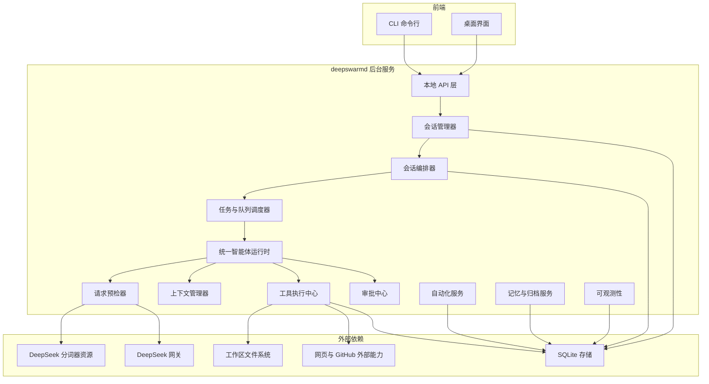
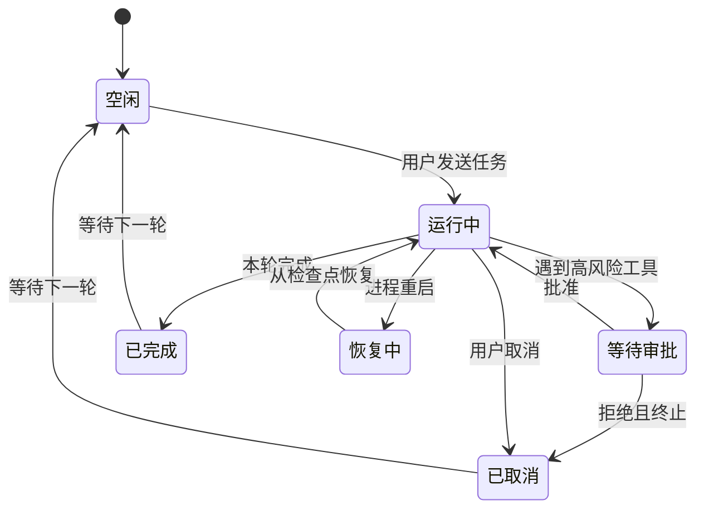
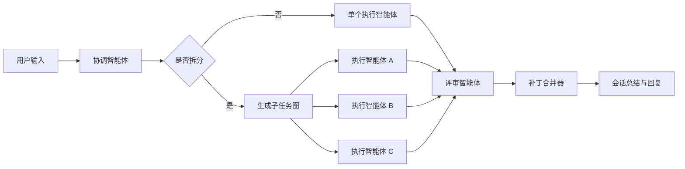

# DeepSwarm Agent 设计文档

## 1. 文档目标

本文定义一个面向 DeepSwarm 的 Agent(智能体) 实现方案，范围只覆盖：

- 只接入 DeepSeek(深度求索) 模型，不做多模型路由
- DeepSeek 接入以 [DeepSeekAPI完整开发手册-官方文档只读.md](D:/code/git_code/ai/DeepSwarm/DeepSwarm_main/docs/DeepSeekAPI完整开发手册-官方文档只读.md) 的官方稳定调用规范为准
- 每次模型请求发送前必须先计算 token(令牌) 数量
- 代码实现语言固定为 Rust(编程语言)
- 支持命令行界面与桌面界面两种交互形态
- 支持项目下多会话
- 支持单会话多智能体协作
- 支持海量并发，目标为约 3000 个并发会话
- 覆盖现有工具清单、审批、上下文预算、自动保存与恢复

本文刻意不做以下内容：

- 不设计多云、多模型、多供应商切换
- 不设计分布式集群版调度
- 不设计插件市场或复杂扩展框架
- 不把 GitHub、网页、自动化做成独立子平台
- 不接入 DeepSeek Beta(测试版) 地址、Anthropic(人机对话接口) 兼容接口、Prefix(前缀续写) 和 FIM(中间填充) 补全

结论先行：首版最合适的形态不是“每个前端自己跑一套 Agent”，而是一个本地后台服务 `deepswarmd` 作为唯一运行时，CLI(命令行界面) 与桌面界面都只做客户端。

## 2. 设计目标与非目标

### 2.1 设计目标

1. 一个项目下可以创建、切换、恢复多个会话。
2. 一个会话可以在需要时拉起多个智能体并行完成子任务。
3. 3000 个会话并发在线时，系统仍可稳定保存状态、切换会话、排队执行任务。
4. 对用户保持连续多轮对话体验，支持流式输出、取消、审批、历史回放。
5. 工具层统一封装，避免每类工具各写一套执行框架。
6. 只围绕 DeepSeek 做能力和限流设计，减少抽象层浪费。

### 2.2 非目标

1. 不承诺 3000 个会话同时各自占用一个模型流。
2. 不在首版实现跨机器调度。
3. 不在首版实现复杂长期学习，只保留项目记忆、会话摘要和归档回忆。
4. 不为不同角色智能体分别实现完全不同的运行时，只保留统一运行时和角色配置。

## 3. 核心设计结论

### 3.1 一句话方案

采用“单后台服务 + 会话 Actor(参与者模型) + 统一 Agent Runtime(智能体运行时) + DeepSeek 请求代理 + 工具执行沙箱”的结构。

### 3.2 关键决策

1. `deepswarmd` 是唯一状态中心。
2. Session(会话) 是系统一级对象，Agent(智能体) 是会话内部的执行单元，不直接暴露给前端。
3. 3000 并发的关键不是 3000 个线程，而是 3000 个轻量会话状态机加少量真实活跃执行槽。
4. 单会话多智能体通过“计划拆分 + 补丁合并”实现，不让多个智能体直接同时写主工作目录。
5. DeepSeek 接入只做一个 `DeepSeekGateway`，统一处理流式输出、函数调用、重试、限流、计费与熔断。
6. 持久化优先使用 SQLite(轻量数据库) + 文件存储，不引入额外基础设施。
7. DeepSeek 只走官方稳定 OpenAI(开放人工智能) 兼容接口 `https://api.deepseek.com`，不依赖 `/beta` 或兼容层。
8. 每次请求前必须先用本地分词器预估输入 token，再决定是否压缩上下文或下调输出预算。
9. 全部工程代码用 Rust 编写，命名遵循主流 Rust 约定。

## 4. 总体架构



### 4.1 为什么要拆成后台服务

如果 CLI 和桌面界面各自维护会话、模型连接、运行中的进程，会马上出现三类问题：

- 同一项目的会话历史无法共享
- 桌面端无法接管 CLI 正在跑的任务
- 3000 并发时状态会散落在多个进程里，无法统一限流和恢复

因此首版必须共享一个后台服务。

## 5. 核心对象模型

### 5.1 对象层级

```text
Project(项目)
└── Session(会话)
    ├── Turn(用户轮次)
    ├── AgentGroup(本轮智能体组)
    │   ├── CoordinatorAgent(协调智能体)
    │   ├── WorkerAgent(n)
    │   └── ReviewerAgent(n)
    ├── ToolRun(工具执行记录)
    ├── ApprovalRequest(审批请求)
    ├── Artifact(产物)
    └── SessionMemory(会话摘要与归档)
```

### 5.2 关键实体

| 实体 | 作用 | 关键字段 |
|---|---|---|
| `Project` | 项目级隔离边界 | `id`、`name`、`root_path`、`default_model_profile` |
| `Session` | 多轮对话与执行载体 | `id`、`project_id`、`title`、`cwd`、`state`、`model_profile` |
| `Turn` | 一次用户输入及其执行过程 | `id`、`session_id`、`input`、`status`、`started_at` |
| `AgentRun` | 单个智能体实例的生命周期 | `id`、`session_id`、`role`、`task_id`、`state` |
| `TaskNode` | 会话内拆分出的子任务 | `id`、`turn_id`、`depends_on`、`status`、`base_revision` |
| `ToolRun` | 一次工具调用记录 | `id`、`tool_name`、`risk_level`、`status`、`output_ref` |
| `ApprovalRequest` | 高风险操作审批单 | `id`、`scope`、`decision`、`expires_at` |
| `Artifact` | 代码补丁、摘要、日志、测试结果 | `id`、`type`、`uri`、`session_id` |

### 5.3 会话状态机



## 6. 多会话设计

### 6.1 多会话隔离原则

每个会话必须独立保存以下内容：

- 会话名称
- 当前工作目录
- DeepSeek 模型配置
- 消息记录
- 工具执行结果
- 审批决策
- 运行中任务与检查点
- 会话摘要和上下文预算状态

### 6.2 会话不是线程

3000 并发会话下，不为每个会话创建常驻线程。每个会话只保留：

- 一份轻量状态对象
- 一个异步消息队列
- 若干持久化索引

只有在会话进入活跃执行时，才分配真实资源：

- 模型流槽位
- 工具进程槽位
- 智能体执行槽位

### 6.3 会话优先级

会话调度采用三层优先级：

1. 前台交互会话：用户当前正在看的会话
2. 前台后台混合会话：用户刚发起但已切走的会话
3. 纯后台会话：自动化、批处理、低优先级回顾任务

这样可以保证桌面端和 CLI 切换会话时，当前会话总能先得到资源。

## 7. 单会话多智能体设计

### 7.1 角色最小化

单会话多智能体只保留 4 类角色：

| 角色 | 作用 |
|---|---|
| `Coordinator` | 读懂用户目标，决定是否拆分子任务 |
| `Worker` | 执行具体编码、搜索、测试、编辑 |
| `Reviewer` | 审查补丁、测试结果和风险 |
| `Summarizer` | 在上下文过长时整理摘要 |

首版不为每个角色单独写一套运行时，只做一个 `AgentRuntime`，用 `role_profile` 切换提示词、工具集和预算。

### 7.2 拆分策略

`Coordinator` 每轮先判断任务复杂度：

1. 简单问答或单文件小改动：不拆分，单智能体直跑
2. 多文件但强依赖任务：串行拆分，最多 2 到 3 个 worker
3. 相对独立的子任务：并行拆分，交给多个 worker
4. 需要质量把关：在 worker 后挂 reviewer

### 7.3 写冲突处理

为避免多个智能体同时改主工作目录，采用“主工作区 + 智能体补丁层”：

1. `Worker` 读取主工作区的某个 `base_revision`
2. 写操作先落到自己的临时补丁层
3. `Reviewer` 或 `Coordinator` 审查补丁
4. `PatchMerger` 串行把补丁合并进主工作区
5. 如果主工作区已变化，先尝试自动重放补丁；失败则回退到重新生成

这个方案比“每个智能体一份完整 Git worktree”更省磁盘、更省文件句柄，也更适合 3000 会话场景。

### 7.4 单会话执行流



### 7.5 单会话智能体数量上限

为了避免一个会话抢走全部资源，单会话设硬上限：

- 默认最多 6 个活跃智能体
- 前台会话可提升到 8 个
- 后台会话通常限制为 2 到 4 个

这个限制比“理论上无限拉起智能体”更符合真实资源约束。

## 8. 3000 并发设计

### 8.1 并发目标的正确解释

“支持约 3000 个并发”在本方案里的定义是：

- 允许约 3000 个会话同时存在并被快速切换、恢复、排队和继续执行
- 允许其中一部分会话处于热状态并实时流式输出
- 不要求 3000 个会话同时都占用 DeepSeek 的活跃流连接

真正稀缺的资源是：

- DeepSeek 模型请求并发
- Shell/后台进程并发
- 文件写入并发
- 审批等待中的前端连接数

其中 DeepSeek 官方当前账号并发上限为：

- `deepseek-v4-flash`：2500
- `deepseek-v4-pro`：500

因此 3000 会话设计不能等价理解为 3000 条同时活跃模型流。

### 8.2 并发分层

| 层级 | 数量目标 | 说明 |
|---|---|---|
| 常驻会话对象 | 3000 | 轻量状态机，常驻内存或热缓存 |
| 热会话 | 100 到 300 | 最近活跃、有流式输出或工具执行 |
| 活跃模型流 | 64 到 256 | 默认低于官方并发上限，按模型类型分开限流 |
| 活跃工具进程 | 64 到 128 | 受 CPU、磁盘、系统进程数限制 |
| 单会话活跃智能体 | 1 到 8 | 受会话级配额限制 |

### 8.3 调度模型

采用“事件驱动 + 加权公平队列”：

1. 会话收到新输入、工具完成、审批通过、取消请求时产生事件
2. 调度器只处理有事件的会话，不轮询全部会话
3. 所有模型请求进入全局队列
4. 前台交互请求权重大于后台总结和自动化请求
5. 同一会话有最大并发占比，避免饿死其它会话

### 8.4 背压与降级

当 DeepSeek 返回限流、延迟升高或本地资源接近上限时，系统自动做四件事：

1. 先暂停低优先级总结任务
2. 再降低后台会话的活跃智能体数
3. 再压缩会话上下文，减少单次 token
4. 最后把新请求排队，并向前端展示“等待执行”

### 8.5 取消机制

取消不是立即杀进程，而是“检查点取消”：

- 每次 LLM 返回片段后检查一次
- 每次工具开始前检查一次
- 每次工具结束后检查一次
- 长命令通过交互通道发中断信号

这样既能尽快响应取消，也不会破坏文件写入一致性。

## 9. DeepSeek 接入设计

### 9.1 单供应商适配层

所有模型调用统一走 `DeepSeekGateway`，其职责只有 7 件事：

1. 读取 `DEEPSEEK_API_KEY`
2. 固定使用官方稳定基础地址 `https://api.deepseek.com`
3. 维护 HTTP 长连接与流式解析
4. 统一模型请求格式
5. 处理工具调用协议
6. 记录 token、耗时、错误率、缓存命中
7. 处理重试、限流和熔断

首版只接 3 个稳定接口：

| 方法 | 路径 | 用途 |
|---|---|---|
| `POST` | `/chat/completions` | 对话、流式输出、思考模式、JSON 输出、工具调用 |
| `GET` | `/models` | 启动时校验官方可用模型 |
| `GET` | `/user/balance` | 启动自检与余额告警 |

以下官方文档中的能力明确不进入首版实现：

- `/beta` 地址下的 strict(严格模式)
- Prefix(前缀续写)
- FIM(中间填充) 补全
- Anthropic 兼容接口

### 9.2 模型配置方式

官方当前稳定模型以 `deepseek-v4-flash` 和 `deepseek-v4-pro` 为主。首版建议：

- 默认模型：`deepseek-v4-flash`
- 会话级可选覆盖：`deepseek-v4-pro`
- 不再使用 `deepseek-chat` 和 `deepseek-reasoner`，因为官方文档已标注将于 2026-07-24 23:59 弃用
- 不做后台自动跨模型路由，避免策略复杂化

保留 profile(配置档) 概念，但 profile 只表示同一官方接口上的参数组合，不代表额外的供应商抽象：

| Profile | 用途 | 典型参数 |
|---|---|---|
| `interactive` | 正常对话与轻任务 | 默认开启思考模式，`reasoning_effort=high` |
| `planner` | 任务拆分与复杂规划 | 思考模式，必要时 `reasoning_effort=max` |
| `review` | 补丁审查与风险判断 | 思考模式，较短输出 |
| `summary` | 历史压缩与摘要 | 可关闭思考模式，压低输出长度 |

这样上层只感知“场景”，不感知具体模型细节。

补充约束：

- 官方当前模型默认开启思考模式
- 思考模式下 `temperature` 和 `top_p` 实际不生效
- 因此首版不把采样参数作为主要调优手段，优先调 `reasoning_effort`、上下文和 `max_tokens`

### 9.3 请求前 token 预计算

每次调用 `/chat/completions` 之前，必须先经过 `RequestPreflight`：

1. 从 `docs/refrence/deepseek_v3_tokenizer/deepseek_v3_tokenizer` 加载 `tokenizer.json` 与 `tokenizer_config.json`
2. 使用 `tokenizer_config.json` 中的 `chat_template` 把当前 `messages` 渲染成真正要发给模型的提示文本
3. 对渲染后的文本做分词编码，得到 `estimated_prompt_tokens`
4. 根据模型配置预留 `reserved_completion_tokens`
5. 检查 `estimated_prompt_tokens + reserved_completion_tokens` 是否超出当前模型上下文预算
6. 如果超出，则先触发上下文压缩、摘要替换或下调输出预算，之后重新计算
7. 只有预算通过后，才真正发起 HTTP 请求

实现约束：

- 生产代码直接使用 Rust 读取分词器资源，不依赖 `deepseek_tokenizer.py`
- `deepseek_tokenizer.py` 只作为参考验证脚本，不进入运行时主链路
- 预估结果用于请求准入、上下文裁剪、排队和成本预警
- 最终计费与真实 token 数以 DeepSeek 响应 `usage` 为准

额外注意：

- 参考分词器目录名是 `deepseek_v3_tokenizer`，而首版接入模型是 `deepseek-v4-flash` 与 `deepseek-v4-pro`
- 因此这里把本地分词器视为“预估器”，并保留后续替换资源文件的能力
- `tokenizer_config.json` 里的 `model_max_length=16384` 不能直接当作线上硬上限
- 真正的上下文上限必须来自 DeepSeek 模型配置和官方文档，当前按 1M token 设计

### 9.4 请求生命周期

```text
AgentRuntime
  -> 构造 Prompt(提示词) 与工具定义
  -> 生成合规 user_id(仅字母数字、横线、下划线)
  -> 调用 RequestPreflight 计算 estimated_prompt_tokens
  -> 若预算不足则先压缩上下文再重新计算
  -> 向 DeepSeekGateway 申请并发槽位
  -> 发起流式请求
  -> 忽略空行和 : keep-alive 保活注释
  -> 持续接收 reasoning_content、content 或 tool_calls 增量
  -> 若触发工具，则暂停模型流并执行工具
  -> 回传 role=tool 的工具结果
  -> 将工具结果回灌模型继续
  -> 结束后写入 token、缓存命中、模型名与审计日志
```

多轮对话必须严格遵循官方无状态规则：每次请求都回传完整 `messages`。如果当前轮包含工具调用，则必须把上一轮 `assistant` 完整消息对象回传，不能丢 `reasoning_content`，否则会触发 HTTP 400。

### 9.5 错误处理

| 错误类型 | 处理策略 |
|---|---|
| 400/422 参数错误 | 立即停止重试，记录原始请求并回退到保守参数 |
| 401 认证错误 | 立即停止请求并提示检查 `DEEPSEEK_API_KEY` |
| 402 余额不足 | 立即停止新任务并触发余额告警 |
| 429 限流 | 指数退避，降低全局活跃模型流 |
| 网络超时 | 快速重试 1 次，失败则排队重试 |
| 响应格式异常 | 记录原始片段，回退到保守解析 |
| 500/503 临时故障 | 有限次数退避重试 |
| 连续失败 | 打开熔断，短时间拒绝新请求并提示排队 |

### 9.6 工具调用与 JSON 输出约束

基于官方文档，首版实现要额外遵守以下规则：

1. 工具参数必须先做本地 JSON 与 Schema 校验，不能直接信任模型输出。
2. `tool` 消息必须带 `tool_call_id` 回传。
3. JSON 输出模式必须显式设置 `response_format={"type":"json_object"}`。
4. JSON 输出提示词中必须出现 `json` 字样，并给出预期结构示例。
5. JSON 输出偶发空 `content` 时，只做有限次重试，不做无限兜底。

## 10. 工具系统设计

### 10.1 统一工具接口

所有工具实现统一的 `ToolExecutor` 协议：

- `schema`：参数定义
- `risk_level`：风险等级
- `timeout`：默认超时
- `run`：执行逻辑
- `cancel`：取消逻辑
- `stream`：是否支持流式结果

这比“每个工具一个独立特殊流程”更容易维护。

### 10.2 工具分组

| 分组 | 对应工具 | 后台模块 |
|---|---|---|
| 文件与目录 | `read_file`、`write_file`、`edit_file`、`list_dir`、`apply_patch` | `WorkspaceService` |
| 结果与回放 | `retrieve_tool_result`、`handle_read` | `ResultStore` |
| 搜索与网页 | `grep_files`、`file_search`、`web_search`、`fetch_url`、`web_run` | `SearchService`、`WebService` |
| 命令与进程 | `run_shell`、`exec_shell`、`exec_shell_wait`、`exec_shell_interact`、`exec_shell_cancel`、`exec_wait`、`exec_interact` | `ProcessService` |
| Git 与协作 | `git_status`、`git_diff`、`git_log`、`git_show`、`git_blame`、GitHub 相关工具 | `GitService`、`GitHubService` |
| 计划与自动化 | `task_*`、`update_plan`、`checklist_*`、`todo_*`、`automation_*` | `PlanningService`、`AutomationService` |
| 多智能体与辅助 | `agent_*`、`rlm_*`、`review`、`project_map`、`note`、`recall_archive`、`remember` | `AgentService`、`MemoryService` |
| 诊断与交互辅助 | `diagnostics`、`validate_data`、`run_tests`、`fim_edit`、`request_user_input`、`load_skill`、`notify` | `AssistService` |

### 10.3 审批设计

审批中心只保留 3 个用户可见决策，和需求一致：

1. 本次允许
2. 当前轮次全部允许
3. 拒绝执行

内部再按风险级别区分：

| 风险级别 | 示例 | 默认策略 |
|---|---|---|
| 只读 | 读文件、搜索、`git log` | 自动通过 |
| 本地写 | 写文件、补丁、构建 | 按策略可自动通过 |
| 命令执行 | `run_shell`、后台进程 | 默认需审批 |
| 网络写 | GitHub 评论、关闭议题 | 默认需审批 |
| 系统级 | 高风险系统修改 | 强制审批 |

### 10.4 工具结果回看

每个 `ToolRun` 都有唯一 `tool_run_id`，输出保存为：

- 小结果直接入库
- 大结果落文件并存引用
- 流式结果按块保存

这样 `retrieve_tool_result`、`handle_read` 和历史回放都能复用同一存储结构。

## 11. 上下文预算与记忆设计

### 11.1 三层上下文

每次调用 DeepSeek 时，上下文由三层构成：

1. 固定层：系统提示词、工具定义、项目规则
2. 会话层：最近若干轮消息、当前任务、未完成审批、关键工具结果
3. 归档层：自动摘要、长期记忆、相关历史产物

### 11.2 预算策略

使用四段式预算水位：

| 水位 | 动作 |
|---|---|
| 0% 到 70% | 正常保留最近对话 |
| 70% 到 85% | 开始压缩旧工具输出 |
| 85% 到 95% | 生成轮次摘要，替换旧消息 |
| 95% 以上 | 只保留最近关键消息和摘要，暂停继续扩张 |

### 11.3 记忆写入

记忆分三类：

| 类型 | 内容 | 存储位置 |
|---|---|---|
| `SessionMemory` | 本会话关键结论 | 会话表 |
| `ProjectMemory` | 项目规范、常用命令、目录理解 | 项目表 |
| `ArchiveMemory` | 历史任务总结、可回忆片段 | 归档表 |

`remember` 只写稳定信息，不写一次性执行噪声。

## 12. 持久化与恢复设计

### 12.1 存储选型

首版只用两类存储：

1. SQLite：结构化状态
2. 文件存储：大文本、日志块、补丁、命令输出

### 12.2 需要持久化的内容

- 项目与会话元数据
- 消息历史
- AgentRun 状态
- TaskNode 依赖关系
- ToolRun 结果索引
- 审批记录
- 自动化定义
- 上下文摘要
- 取消标记与恢复检查点

### 12.3 恢复流程

后台服务重启后执行：

1. 加载所有项目与会话
2. 将运行中的 `Turn` 标记为 `recovering`
3. 回收已失联的本地进程句柄
4. 对未完成工具运行做一致性检查
5. 从最近检查点恢复会话状态
6. 通知前端“可继续”或“需重试”

### 12.4 自动保存

以下时机强制自动保存：

- 用户发出新输入后
- Agent 完成一步后
- 工具完成后
- 审批状态变化后
- 会话摘要更新后

首版不需要单独做复杂日志系统，只要“每一步完成就落库”即可。

## 13. CLI 与桌面界面设计

### 13.1 统一 API

CLI 和桌面界面都调用同一组本地 API：

- `POST /projects/open`
- `POST /sessions`
- `POST /sessions/{id}/switch`
- `POST /sessions/{id}/turns`
- `POST /sessions/{id}/cancel`
- `GET /sessions/{id}/stream`
- `GET /sessions/{id}/state`

流式输出使用 WebSocket(双向实时通道) 或 Server-Sent Events(服务器推送事件) 二选一即可；为减少实现分叉，建议后台统一产出事件流，CLI 和桌面端都订阅同一格式。

### 13.2 CLI 能力

CLI 负责：

- 创建会话
- 切换会话
- 查看状态
- 清屏
- 取消当前任务
- 持续多轮对话
- 共享输入历史，本地再缓存最近输入用于快捷翻阅

CLI 不负责保存业务状态，状态一律在后台服务。

### 13.3 桌面界面能力

桌面端负责：

- 打开项目
- 创建会话
- 切换会话
- 发送任务
- 展示流式回复
- 展示审批弹窗
- 展示会话树与运行状态
- 读取同一份输入历史与消息历史

桌面端也不直接持有真实执行状态，只做展示和交互。

## 14. 自动化与待办设计

### 14.1 自动化边界

根据需求，“当前自动化为基础版，不包含常驻调度器”，因此自动化只做：

- 保存自动化定义
- 查询自动化定义
- 手动触发执行
- 暂停与恢复可执行状态

不做后台长期驻留 cron(定时调度器)。

### 14.2 待办与计划

计划、检查清单、待办都挂在 Session 或 Turn 下：

- `update_plan` 更新当前轮次执行计划
- `checklist_*` 记录验收项
- `todo_*` 记录稍后处理项

这样它们天然跟会话历史一起恢复。

## 15. 可观测性与容量规划

### 15.1 必须采集的指标

| 类别 | 指标 |
|---|---|
| 会话 | 总会话数、热会话数、排队会话数、恢复中的会话数 |
| 模型 | 活跃模型流数、平均首 token 延迟、429 次数、token 消耗 |
| 智能体 | 活跃智能体数、按角色分布、失败率 |
| 工具 | 调用次数、耗时、取消率、审批等待时长 |
| 系统 | 内存占用、CPU、文件句柄、进程数、磁盘占用 |

### 15.2 容量控制开关

建议提供以下配置项：

```toml
[runtime]
max_sessions = 3000
max_hot_sessions = 300
max_active_model_streams_flash = 256
max_active_model_streams_pro = 64
max_active_tool_processes = 96
max_agents_per_session = 6
foreground_boost = true

[deepseek]
api_key_env = "DEEPSEEK_API_KEY"
base_url = "https://api.deepseek.com"
default_model = "deepseek-v4-flash"
context_window_tokens_flash = 1000000
context_window_tokens_pro = 1000000
request_timeout_secs = 90
max_retry = 2

[tokenizer]
dir = "docs/refrence/deepseek_v3_tokenizer/deepseek_v3_tokenizer"
estimate_before_every_request = true

[context]
summary_threshold = 0.85
hard_trim_threshold = 0.95
```

### 15.3 内存策略

为支撑 3000 会话，必须把“大内容不常驻内存”作为硬规则：

- 会话元数据常驻
- 大消息体按需加载
- 长命令输出分块落盘
- 大网页抓取结果分块存储
- 历史工具结果默认只加载摘要

## 16. Rust 实现与命名规范

### 16.1 语言与工程组织

- 运行时、CLI(命令行界面)、桌面端后端适配层统一使用 Rust 实现
- 工程组织采用 Cargo Workspace(Cargo 工作区)
- 分层保持轻量，优先按职责拆 crate(包) 与模块，不做未来导向的大而全抽象

建议的 crate 命名示例：

- `deep-swarm-app`
- `deep-swarm-runtime`
- `deep-swarm-deepseek`
- `deep-swarm-storage`
- `deep-swarm-tools`
- `deep-swarm-tokenizer`

### 16.2 主流 Rust 命名约定

| 对象 | 命名方式 | 示例 |
|---|---|---|
| crate(包) 名 | kebab-case(短横线小写) | `deep-swarm-runtime` |
| 模块、文件、函数、字段、局部变量 | snake_case(下划线小写) | `request_preflight`、`count_tokens_for_request` |
| 结构体、枚举、Trait(特征)、枚举变体 | UpperCamelCase(大驼峰) | `DeepSeekGateway`、`TokenCounter` |
| 常量、静态变量 | SCREAMING_SNAKE_CASE(全大写下划线) | `DEFAULT_MAX_RETRY` |
| 缩写词 | 按普通单词处理 | `ApiClient`、`HttpServer`，不用 `APIClient` |

补充要求：

- 对外 JSON 字段如果必须保持官方命名，使用 `serde` 映射，内部 Rust 字段仍保持 snake_case
- Trait(特征) 名优先表达能力，如 `TokenCounter`、`ToolExecutor`，避免无意义的 `Helper`、`Util`
- 异步函数名用动词短语，如 `send_chat_request`、`load_tokenizer_assets`

### 16.3 分词与网关命名建议

围绕这次需求，首版建议至少保留以下 Rust 类型或模块名：

- `deepseek_gateway.rs`
- `request_preflight.rs`
- `token_counter.rs`
- `context_budget.rs`
- `session_store.rs`
- `tool_executor.rs`

这样既贴合职责，也符合 Rust 社区常见命名方式。

## 17. 最小可行实施顺序

### Phase 1：单后台服务闭环

- 实现 `deepswarmd`
- 打通项目、会话、消息存储
- 接入 DeepSeek 流式对话
- 接入本地分词器预计算链路
- CLI 接到后台服务

### Phase 2：工具、审批与恢复

- 接入文件、搜索、Shell、Git 基础工具
- 实现审批中心
- 实现自动保存与恢复
- 补齐桌面端事件流

### Phase 3：单会话多智能体

- 加入 `Coordinator`、`Worker`、`Reviewer`
- 实现任务拆分与补丁层
- 实现补丁合并与冲突回退

### Phase 4：3000 并发优化

- 接入全局公平队列
- 接入热会话与冷会话分层
- 接入 DeepSeek 并发控制与熔断
- 压测并校正阈值

## 18. 风险与对应策略

| 风险 | 说明 | 策略 |
|---|---|---|
| DeepSeek 配额不足 | 3000 会话下热点会话争抢模型流 | 做全局排队与前后台优先级 |
| 多智能体写冲突 | 同会话多个 worker 改同一文件 | 用补丁层和串行合并 |
| 会话上下文膨胀 | 长对话与长工具输出迅速吃满上下文 | 四段式预算压缩 |
| Shell 任务失控 | 长任务卡住或输出过大 | 分块输出、超时、取消信号 |
| 状态散落前端 | CLI 和桌面端状态不一致 | 一律由后台服务持久化 |
| 分词器与线上模型漂移 | 本地预估 token 与官方实际 usage 存在偏差 | 预估只做准入，计费以 `usage` 为准，并保留替换分词器资源能力 |

## 19. 最终建议

首版最值得坚持的约束只有三条：

1. 只有一个后台服务，所有前端都连它。
2. 只有一个 DeepSeek 适配层，不提前做多模型抽象。
3. 只有一个统一智能体运行时，不为不同角色复制系统。

这三条守住后，DeepSwarm 才有机会先把“多会话 + 单会话多智能体 + 3000 并发排队运行”做稳，再逐步扩展。
