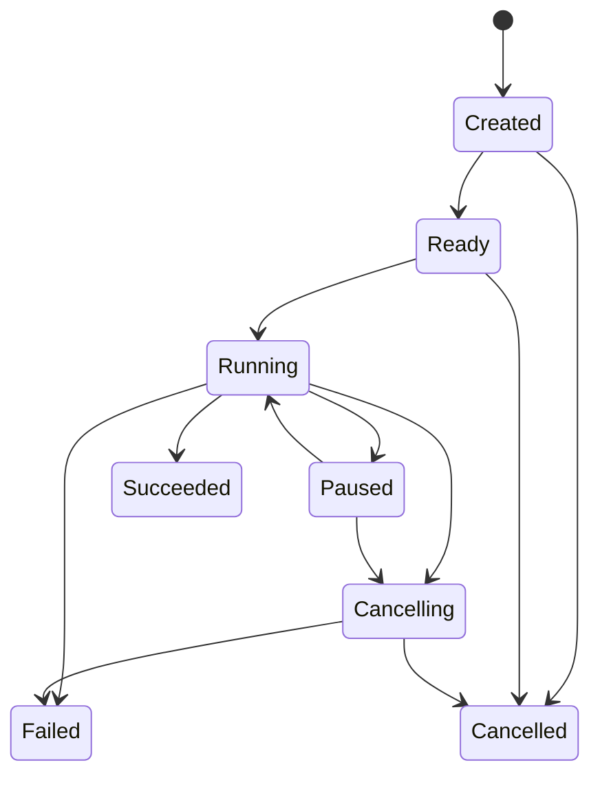
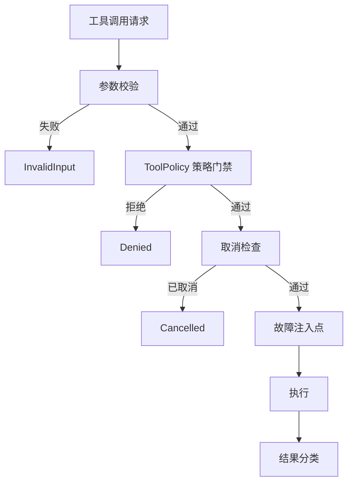
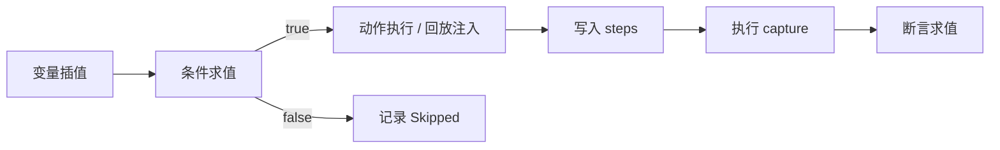

# DeepSwarm 设计文档

## 1. 设计目标

当前版本构建一个由 Rust 实现、面向 DeepSeek API(应用程序接口) 的测试与评估 Harness(测试框架)。首版仅保证 DeepSeek 客户端、模拟服务、测试用例和报告链路；核心模块保留模型适配边界，但其他 LLM(大语言模型) 智能体系统不属于首版支持及验收范围。

首版范围：

- 支持 DeepSeek 官方 OpenAI 兼容协议及本文明确列出的扩展字段。
- 模拟工具和模拟 DeepSeek 服务默认启用，真实工具与真实 API 必须显式授权。
- 支持本地单进程执行，以及本文定义的单协调器分布式执行。
- 不承诺兼容其他模型供应商，也不提供协调器高可用、原生动态库插件或插件热更新。

核心能力：

- 高并发多智能体协同测试：首版支持单个会话最多 500 个 Agent(智能体) 并发，以及最多 100 个独立会话同时运行，验收条件见“并发验收基线”。
- Fork / 继承模式：模拟 Agent 的派生与上下文继承，验证子 Agent 的状态隔离与信息传递。
- 工具链覆盖：目标目录规划文件、搜索、Shell、Git、任务、PR、GitHub、自动化、计划、子智能体、RLM 等工具；首版只交付本文列出的 12 个无副作用模拟工具，其余属于后续路线图。
- 多维测试能力：功能正确性、性能（延迟/吞吐）、安全（提示注入、模糊测试）、稳定性（长稳、资源泄漏）。
- 可观测性：实时指标、结构化日志、分布式追踪、CI 友好的报告输出。
- 开发者友好：命令行工具、录制回放、Mock 服务器、插件体系。

术语约定：`Run` 指一次测试运行及其配置、资源与报告边界；`Session` 指一组 Agent 的共享状态与取消边界；`Agent` 指 Session 内的异步执行单元；“步骤”指 DSL 中一次动作及其断言；“任务”指协调器发给工作节点的调度单元，可包含一个或多个用例，不等同于步骤；`fixture`(测试夹具)指固定输入、事件或期望结果；`Mock`(模拟实现)指不访问真实外部系统的实现。

---

## 2. 核心设计考量

### 2.1 多智能体协同与并发模型

- Agent 抽象：每个 Agent 为一个异步任务，拥有独立的上下文、工具权限、对话历史。
- Session 管理：一个 Session 可容纳 1～500 个 Agent，通过 SessionManager 维护生命周期。
- Fork 模式：Agent A 派生出 Agent B，B 继承 A 的指定状态快照，后续独立运行。
- 继承模式：Agent B 可显式共享工作目录或计划板，未声明的状态仍为私有副本。
- 并发控制：首版固定采用 Actor(消息驱动执行单元)模型。每个 Agent 由一个 Tokio 任务独占其私有状态，通过有界 `tokio::sync::mpsc` 邮箱串行接收命令；不得在 Agent 热路径使用全局共享写锁，也不得跨 `await` 持锁。
- 资源控制：进程内 Agent 只提供并发数、队列长度、超时、消息和输出字节数等软预算；内存和进程级资源硬限制由独立工作进程提供。
- 通信通道：Agent 间只通过有界消息通道协调。共享工作区由独立 Workspace Actor 串行管理，读取返回协调器维护的单调递增 `u64` 版本号，写入携带 `expected_version` 并按 CAS(compare-and-swap，比较并交换)语义更新；版本不匹配返回 `StateConflict`。Shell、Git 等绕过文件工具的共享目录写入必须取得 Session 级独占写租约。

#### 2.1.1 Fork 与继承状态矩阵

| 状态项 | Fork 模式 | 继承模式 | 冲突与限制 |
| --- | --- | --- | --- |
| 系统提示、历史消息、非敏感环境变量 | 创建时复制，之后独立 | 创建时复制，之后独立 | 不共享写入 |
| 工具权限、资源预算 | 复制，但子 Agent 只能收窄 | 复制，但子 Agent 只能收窄 | 越权配置拒绝创建 |
| 工作目录、计划板 | 创建私有副本 | 仅显式声明的项共享 | 共享写入携带版本号；旧版本写入返回 `StateConflict`，不得静默覆盖 |
| 凭证 | 不复制明文，只能重新解析授权句柄 | 同左 | 未授权凭证不可见 |
| 运行中的模型请求、工具调用、取消令牌 | 不复制 | 不共享 | 子 Agent 从空闲状态开始 |

子 Agent 创建为原子操作，失败时不得留下可调度的半成品。父 Agent 终止不自动终止已创建的子 Agent，子 Agent 终止也不影响父 Agent；只有 Session 终止会取消该会话内的全部 Agent。

验收条件：修改父 Agent 的私有状态不得改变子 Agent；继承模式只共享声明项；两个 Agent 基于同一版本并发写共享状态时只能有一个成功；Session 终止后全部 Agent 必须进入终态。

#### 2.1.2 生命周期

Agent 状态固定为：`Created`(已创建)、`Ready`(已就绪)、`Running`(运行中)、`Paused`(已暂停)、`Cancelling`(取消中)、`Succeeded`(成功)、`Failed`(失败)、`Cancelled`(已取消)。

合法迁移：

- `Created -> Ready | Cancelled`
- `Ready -> Running | Cancelled`
- `Running -> Paused | Cancelling | Succeeded | Failed`
- `Paused -> Running | Cancelling`
- `Cancelling -> Cancelled | Failed`

`Succeeded`、`Failed`、`Cancelled` 为终态。暂停请求发出后不再调度新步骤，只有当前活动步骤完成且仍有待执行步骤时才进入 `Paused`；当前步骤直接决定成功或失败时，从 `Running` 进入对应终态。取消沿 Run(运行) → Session → Agent → Tool(工具) 传播。终态查询和重复取消必须幂等，其他非法迁移返回 `InvalidState`。每个终态记录时间和原因，且每个 Agent 只能发出一次完成事件。



#### 2.1.3 资源隔离

- 进程内软预算：最大并发调用数、队列长度、截止时间、消息大小、输出大小和取消宽限期；超限时停止派发并返回明确错误。
- 模拟工具基线默认在同一进程执行，不启用硬隔离；每个 Agent 使用有界邮箱，调度器采用轮询公平调度和全局并发信号量，队列满返回 `ResourceExhausted`，任何 Agent 不得连续占用全部派发配额。
- 硬隔离：不受信任场景和真实工具在独立工作进程中执行。Linux 使用 cgroup v2 和 rlimit 设置内存、CPU、进程数及文件描述符限制；Windows 使用 Job Object 设置内存、CPU 和进程数限制，句柄数量由监督进程监测并在超限时终止工作进程。
- 硬隔离粒度首版为工作节点或 Session，不承诺每个 Agent 独立进程或精确内存配额。
- 需要 Session 级硬配额时，一个工作进程只能承载一个 Session；同一工作进程承载多个 Session 时只承诺工作节点聚合上限，不宣称 Session 级隔离。
- 工作进程因 OOM(内存耗尽) 或限制超额退出时，协调器记录 `ResourceExhausted`；主进程不得声称能在自身 OOM 后自救。
- 请求硬限制但当前平台无隔离后端时，启动必须失败，不得静默降级为软预算。
- 超时先传播取消；默认取消宽限期为 5 秒，可在 Run 配置中设置为 100 毫秒～60 秒。宽限期后仍未退出时终止工作进程，而不是在同一 Tokio 进程中强制杀死异步任务。

验收条件：工作进程超出内存或时间限制后被终止，协调器保持运行并记录唯一终态；进程内软预算超限后停止新派发并取消当前操作，已经发出的外部写入按 `OutcomeUnknown` 处理，不承诺撤回已发生的副作用。

#### 2.1.4 并发验收基线

| 项目 | 基线 |
| --- | --- |
| 环境 | 本机电脑、Rust stable、`release` 构建、本机 `deep-swarm-mock-server`、无其他显著负载 |
| 场景 A | 单独运行：1 个 Session × 500 个 Agent |
| 场景 B | 单独运行：100 个 Session × 每会话 5 个 Agent |
| 负载 | 稳定阶段固定输入 200 步/秒，每个 Agent 最多 1 个在途步骤；每步包含 1 次 1 KiB 模拟模型响应和 1 次无副作用模拟工具调用；另以 250 步/秒运行 5 分钟突发阶段 |
| 时长 | 预热 5 分钟，稳定运行 30 分钟 |
| 通过阈值 | 稳定阶段有效吞吐 ≥ 195 步/秒；步骤端到端 P95(第 95 百分位延迟) ≤ 200 ms；峰值 RSS(常驻内存集) ≤ 4 GiB；内部错误率 ≤ 0.1%；步骤完成率 ≥ 99.9%；突发结束后 60 秒内清空积压 |
| 稳定性 | 无 panic、死锁或永久挂起；稳定阶段基线取最后 5 分钟 RSS 样本的中位数，停止负载 5 分钟后 RSS 不高于该值的 110% |

基线只在带固定标签的独占 Linux runner(运行节点)执行，`rust-toolchain.toml` 固定 Rust 版本；`deep-swarm-mock-server` 作为独立进程且不计入框架 RSS。稳定阶段每秒汇总框架主进程及其工作子进程 RSS；延迟从计划入队时刻计至步骤终态；有效吞吐为终态步骤数除以阶段实际秒数；内部错误率为框架错误步骤数除以计划步骤数；完成率为终态步骤数除以计划步骤数。P95 使用 nearest-rank(最近秩)算法 `ceil(0.95 * N)`。性能报告必须包含 `rustc -Vv`、CPU、内核、提交哈希、构建参数、总 Agent 数、Session 数、计划与终态步骤数、持续时间、吞吐、P95、峰值 RSS、完成率和错误率。外部 DeepSeek 网络延迟不计入该调度基线，场景 A、B 分别执行，任一阈值失败即判定失败；环境不符合要求时标记“环境不符”，不判定产品失败。

场景 A（单 Session 高密度）侧重 Agent 调度密度和 Actor 邮箱吞吐；场景 B（多 Session 低密度）侧重 Session 创建/销毁开销和跨 Session 隔离开销。两者 Agent 总量相同但压力点不同，不可互相替代。

### 2.2 工具系统设计

- 统一 Tool trait 及结果契约（Rust 伪代码）：

```rust
trait Tool: Send + Sync {
    fn name(&self) -> &str;
    fn description(&self) -> &str;
    fn parameters_schema(&self) -> serde_json::Value;
    async fn execute(&self, params: serde_json::Value, ctx: &ToolContext) -> ToolResult;
}

struct ToolContext {
    run_id: RunId,
    session_id: SessionId,
    agent_id: AgentId,
    call_id: CallId,
    workspace_root: PathBuf,
    policy: ToolPolicySnapshot,
    deadline: Instant,
    cancellation: CancellationToken,
    secret_handles: Vec<SecretHandle>,
}

enum ToolResult {
    Success { value: serde_json::Value, metadata: ToolMetadata },
    Failure { category: ToolErrorCategory, message: String, retryable: bool },
}

enum ToolErrorCategory {
    InvalidInput,
    Denied,
    NotFound,
    Timeout,
    Cancelled,
    RateLimited,
    ResourceExhausted,
    CleanupFailed,
    OutcomeUnknown,
    External,
    Internal,
}
```

- 工具注册表：进程级内置目录在启动后只读；每个 Run 基于该目录创建隔离覆盖层。首版仅允许可信 Rust 嵌入方调用 `RunBuilder::register_tool(Arc<dyn Tool>)`，并且只能在 `build()` 前注册自定义工具；注册时校验唯一名称、参数 Schema、能力声明以及模拟/真实属性，`build()` 后冻结。CLI(命令行界面)不支持动态加载外部自定义工具，`.wasm` 插件也不能注册工具。重名注册失败，不允许后注册覆盖；Session 和 Agent 只获得按权限过滤的视图，Run 结束即释放覆盖层。
- 首版模拟工具清单固定为 `read_file`、`grep_files`、`run_shell`、`git_status`、`task_create`、`pr_attempt_record`、`github_issue_context`、`automation_list`、`update_plan`、`agent_open`、`rlm_open`、`diagnostics`。每项必须具有唯一名称、参数 Schema 和无副作用实现；未列出的目标目录工具返回 `NotFound`，不得以空壳实现计入支持数量。
- 工具分类组织：文件、搜索、Shell、Git、任务、PR、GitHub、自动化、计划、子智能体、RLM、其他。
- 模拟与真实实现分离：默认使用快速、无副作用的模拟实现；真实实现只能在显式授权和硬隔离满足要求时启用。
- 工具调用拦截：参数校验、`ToolPolicy` 策略门禁、取消检查、执行、结果分类依次处理；测试故障注入位于策略门禁之后，不得绕过安全检查。



参数不符合 Schema 返回 `InvalidInput`，策略拒绝返回 `Denied`，截止时间到期返回 `Timeout`，上级取消返回 `Cancelled`。工具收到取消后必须停止后续副作用，并在宽限期内返回；注册表不得保存凭证明文或可变调用状态。

#### 2.2.1 真实工具安全边界

真实工具遵循默认拒绝原则，每个场景必须显式声明允许的工具和能力：

- 文件：先规范化路径，再验证路径位于隔离工作根目录；拒绝绝对路径、`..` 穿越和符号链接逃逸。默认只允许临时工作区，结束时清理。
- Shell：使用“程序 + 参数数组”执行；命令、工作目录和环境变量均采用允许列表；限制超时、输出大小和子进程数，取消或结束时终止整个进程树。
- Git：只允许隔离工作树内的本地操作；远端访问默认关闭。
- 网络：默认关闭；启用时按协议、主机和端口允许列表放行。禁止 HTTP 客户端自动重定向；每次新建 TCP(传输控制协议)连接和每次重定向都必须重新解析 DNS(域名系统)，过滤并批准目标 IP，再将该 IP 固定到实际 socket(套接字)连接，同时保留原主机名用于 TLS SNI(传输层安全服务器名称指示)和 `Host`。默认阻止回环、内网、链路本地和云元数据地址；环境代理默认禁用，显式启用的代理同样受策略约束。
- GitHub：默认只读；写操作必须同时授权仓库和动作，禁止跨仓库复用授权。
- 凭证：只以运行时句柄注入，不进入 Agent 上下文、工具参数、日志或结果；工具结束后立即撤销临时凭证。
- 取消：取消确认后不得发起新的副作用；远端写请求已发出但未取得可判定响应时返回 `OutcomeUnknown`(结果不确定)，固定为 `retryable = false`，Run 不得成功，也不得自动重试。报告的 `uncertain_operations` 记录脱敏后的 `call_id`、工具、目标、开始时间、取消时间和原因，作为人工核查清单；核查完成前该项保持未关闭状态。
- 清理：Run 结束时关闭子进程、撤销凭证并删除真实工具工作区；任一项失败统一返回 `CleanupFailed` 并使 Run 失败。只有不含敏感内容的模拟临时目录删除失败可记录为警告。

验收条件：路径穿越、符号链接逃逸、未授权命令、DNS 重绑定、私网访问和未授权 GitHub 写入全部被 `ToolPolicy` 拒绝；取消确认后不再发起新操作，在途远端操作被标记为结果不确定；两个并发 Run 的同名自定义工具和凭证不得串用。

### 2.3 测试引擎

- 用例 DSL(领域专用语言)：使用 YAML / JSON 定义测试场景，顶层必须声明 `version: 1`。
- 断言体系：
  - 结构断言：JSON Schema、字段存在性。
  - 语义断言：关键词匹配、正则、嵌入相似度阈值。
  - 性能断言：延迟 P95 < 目标值、吞吐量 > 基线。
- 负载模型：支持 ramp-up、稳定阶段、突发尖峰，可定义混合场景（多个用例按比例执行）。
- 执行调度：支持本地单进程，以及通过 gRPC(远程过程调用) 连接的单协调器、多工作节点执行。

#### 2.3.1 DSL 执行规则

- `schemas/dsl-v1.schema.json` 是首版唯一结构契约；YAML 先转换为 JSON，再与 JSON 输入使用同一 Schema 校验，所有对象均设置 `additionalProperties: false`。
- 顶层字段为 `version`、`variables`、`data_sources`、`suites`；测试套件字段为 `name`、`variables`、`load`、`assertions`、`cases`；用例字段为 `name`、`variables`、`for_each`、`weight`、`repeat`、`steps`；步骤字段为 `id`、`name`、`variables`、`repeat`、`when`、`tool`、`with`、`capture`、`assertions`。
- 每个步骤的 `id` 必填，在用例内唯一，格式为 `^[A-Za-z_][A-Za-z0-9_]*$`。步骤终态自动写入用例级只读命名空间：成功结果为 `steps.<id>.value` 与 `steps.<id>.metadata`，失败结果为 `steps.<id>.error`，通用状态为 `steps.<id>.status`。只能引用当前步骤之前的步骤；重复 ID 和前向引用在预检阶段返回 `InvalidInput`。
- `capture` 是“运行时变量名 → JSON Pointer”映射，数据源固定为当前步骤的 `steps.<id>`；例如 `capture: {resource_id: /value/id}` 生成用例级只读变量 `runtime.resource_id`。指针不存在返回 `UnresolvedOutput`。运行时变量不可覆盖静态变量、其他步骤结果或既有运行时变量。
- 变量插值语法为 `${path.to.value}`。当字段值恰好只有一个占位符时保留 JSON 原始类型；占位符嵌入字符串时只能引用字符串，否则返回 `InvalidInput`，不做隐式类型转换。`when` 只接受布尔值，或 `{op, left, right}` 比较对象；`op` 首版仅支持 `eq`、`ne`、`lt`、`lte`、`gt`、`gte`、`contains`。`repeat` 为非负整数。
- 静态变量作用域为全局 → 测试套件 → 用例 → 步骤，内层同名变量覆盖外层；`data`、`steps` 和 `runtime` 为引擎保留的只读运行时命名空间，任何作用域不得声明同名变量。
- 每个步骤按“可用变量插值 → 条件求值 → 动作执行或回放结果注入 → 写入 `steps` → 执行 `capture` → 断言求值”的固定顺序运行；条件为 `false` 时记录 `Skipped` 并跳过动作、绑定和断言。引用被跳过或失败步骤中不存在的值，在当前步骤调用工具前返回 `UnresolvedOutput`。


- 单个循环次数范围为 0～1000，展开后的总步骤数不得超过 10000。
- 未知版本、未知字段、静态未定义变量、重复或前向步骤引用、类型不匹配和循环越界均在 Run 启动前返回 `InvalidInput`。依赖运行时输出的工具参数在所属步骤调用前校验；不符合工具 JSON Schema 时该步骤返回 `InvalidInput`，不得调用该工具。
- DSL 不做隐式类型转换；Run 级预检失败时模型和工具调用计数必须仍为 0。运行时绑定失败只保证当前及后续步骤不再产生调用，不抹除此前已完成的调用。

断言契约：

- `assertions` 为有序数组，元素 `id` 在所属步骤或套件内唯一。结构断言为 `{id, type: "exists", actual}` 或 `{id, type: "json_schema", actual, schema}`；文本断言为 `{id, type: "contains" | "regex", actual, expected}`；相似度断言为 `{id, type: "similarity", actual, expected, evaluator, min}`，其中 `evaluator` 使用“名称@版本”，`min` 范围为 0～1。
- 性能断言仅允许位于套件级，格式为 `{id, type: "metric", phase, metric, aggregate, op, value, min_samples}`。`metric` 首版支持 `latency_ms`、`throughput_steps_per_sec`、`error_rate`、`completion_rate`、`rss_bytes`；`aggregate` 支持 `p95`、`rate`、`max`；`op` 支持 `lt`、`lte`、`gt`、`gte`。
- 未知断言类型、不合法字段组合、重复 ID、未注册或版本不匹配的相似度求值器均在预检阶段失败。断言按声明顺序执行，首个失败使所属步骤或套件失败并记录 `assertion_id`；`metric` 样本少于 `min_samples` 时直接失败。

负载与外部数据契约：

- 套件 `load.phases` 由 `{name, duration_seconds, start_rate, target_rate}` 组成；阶段名唯一，时长大于 0，速率非负。速率在阶段内线性变化，相等表示稳定阶段，高目标速率的短阶段表示突发。用例 `weight` 为正数，同套件内归一化后用于分配计划执行次数；性能断言只能引用已定义阶段，指标不得跨阶段混算。
- 顶层 `data_sources` 元素为 `{id, format, path}`，`format` 仅支持 `csv`、`jsonl`；用例以 `for_each` 引用数据源。路径必须为 `tests/fixtures` 根目录下的 UTF-8 相对路径，拒绝绝对路径、`..` 和符号链接逃逸。
- CSV 首行为唯一且非空的列名，值保持字符串；JSONL 每个非空行必须为 JSON 对象并保留类型。记录按文件顺序逐条绑定到只读变量 `data`，稳定用例 ID 为 `<case>:<source>:<1-based-record>`。首版单数据源最多 10000 条；执行前流式校验一次，执行时再次流式读取，解析错误携带脱敏后的相对路径和行号，且任何模型或工具调用数仍为 0。

最小示例：

```yaml
version: 1
data_sources:
  - id: users
    format: jsonl
    path: users.jsonl
suites:
  - name: resource_flow
    cases:
      - name: create_then_query
        for_each: users
        steps:
          - id: create
            tool: task_create
            with: {name: "${data.name}"}
            capture: {resource_id: /value/id}
            assertions:
              - {id: has_id, type: exists, actual: "${runtime.resource_id}"}
          - id: query
            tool: diagnostics
            with: {subject_id: "${runtime.resource_id}"}
            assertions:
              - {id: same_id, type: contains, actual: "${steps.query.value.summary}", expected: "${runtime.resource_id}"}
```

验收条件：第二个步骤可使用第一个步骤输出的字符串、数值和对象字段；重复 ID、前向引用、保留命名空间覆盖和字符串内插入非字符串均被拒绝；被跳过步骤的输出引用返回 `UnresolvedOutput`。每种断言类型至少具有一组通过和失败 fixture，错误字段组合、套件外的性能断言和未知求值器在预检阶段失败。CSV 重复表头、列数不符、JSONL 非对象、非法 UTF-8 和路径逃逸均在调用数为 0 时失败；固定虚拟时钟可重现阶段速率、权重分配、P95、样本不足和阶段隔离结果。

#### 2.3.2 录制与回放

- 首版仅支持标记为 `recordable: true` 且不含敏感字段的模拟 fixture，以及不产生真实副作用的离线精确回放。“敏感 Schema 标记”固定指 JSON Schema 字段上的 `x-deepswarm-sensitive: true`；预检或写入前检测到该标记、`SecretHandle` 或已知密钥模式时返回 `RecordingUnsafe` 并删除部分文件。
- 录制文件必须写出 `format_version: 1`，并包含场景哈希、配置哈希、随机种子，以及按序号排列的模型流式事件、工具调用、完整非敏感结果、错误和耗时。录制文件不使用报告的 4 KiB / 64 KiB 截断规则，也不得写入日志、报告或 CI 制品；报告只能引用其哈希和事件计数。
- 回放期间禁止访问真实模型、网络和真实工具，仅按录制顺序提供结果。每个回放结果先注入对应 `steps.<id>`，再执行 `capture`、后续条件和断言，从而与录制时使用同一变量上下文规则。
- 事件按顺序、调用类型、名称和规范化参数匹配。参数先按 Schema 补齐默认值，再使用 RFC 8785 JSON Canonicalization Scheme(JSON 规范化方案)生成字节和 SHA-256；版本、哈希、事件或参数不一致时，在首个差异处返回 `ReplayMismatch`。
- 未知 `format_version` 在执行任何事件前拒绝；首版只保证同一主版本内兼容。

验收条件：录制后在断网环境可完整回放且真实工具调用数为 0；超过 64 KiB 的非敏感结果可完整还原；含敏感字段的 fixture 在落盘前拒绝；篡改版本、事件顺序或参数时必须在首个差异处失败；相同录制和随机种子的断言结果与最终生命周期状态一致。

#### 2.3.3 分布式执行协议

- 首版采用单协调器和多个无状态工作节点；协调器负责展开任务、持久化运行状态、发放租约、接收结果和最终汇总。
- 每个任务具有稳定的 `run_id`、`task_id` 和 `input_hash`。租约包含 `attempt`、`lease_id`、随机种子和过期时间。
- 工作节点领取 30 秒租约并每 10 秒续租。续租保持当前 `lease_id` 和 `attempt`；租约过期后的每次重新发放都生成新 `lease_id` 并递增 `attempt`。每个任务最多执行 3 次（`max_attempts = 3`，包含首次执行）。
- 执行语义为至少一次。提交结果必须携带 `run_id`、`task_id`、`attempt`、`lease_id`、最大 1 MiB 的 `result_json` 和 `output_hash`；`output_hash` 为 `result_json` 经 RFC 8785 规范化后的 SHA-256。结果信封包含允许字段 Schema 约束的脱敏事件、断言结果、阶段指标和最多 1000 项制品清单；排除时间戳、租约字段、诊断日志与工作节点本地路径，制品仅纳入按逻辑名称排序后的内容哈希，不回传原始临时文件或未脱敏上下文。协调器重新计算哈希后，只接受与当前租约完全匹配的首个终态结果；哈希不匹配返回 `ResultCorrupted`，超限返回 `ResultTooLarge`，重复或过期结果丢弃并记录。
- 结果按 `task_id` 去重。全部任务都有唯一的成功、失败、超时或取消终态后才允许汇总；缺失结果或重试耗尽时 Run 失败并列出任务。
- 断言失败不重试；包含非幂等真实工具的任务也不自动重试，除非工具声明可安全重试并使用幂等键。
- 首版协调器不提供高可用；协调器退出时本次 Run 明确失败，不得产生成功报告。
- 工作节点不生成 JUnit、HTML 或最终 JSON 报告，也不直接上传 CI 制品；它只回传上述脱敏结果信封。协调器只基于已接受的唯一终态统一聚合并生成 `schema_version: 1` 的最终报告；重复、旧租约和拒绝结果只进入脱敏诊断日志，不进入报告计数。工作节点在协调器确认接收、租约失效或任务终止后立即清理本地临时上下文；清理失败按 `CleanupFailed` 上报，不得把临时文件作为补偿通道上传。

验收条件：工作节点失联后任务会重派但只汇总一次；同一 attempt 的错误 `lease_id`、旧租约迟到结果和重复结果不改变计数；第 3 次执行失败和协调器退出均使 Run 明确失败。

### 2.4 DeepSeek 协议契约

- 首版内部契约标识为 `deepseek-1.0.0+2026-07-13`，以 2026-07-13 的官方文档快照和 [DeepSeek API 完整开发手册](./DeepSeekAPI完整开发手册.md) 为基线。
- 正式基础地址为 `https://api.deepseek.com`，Beta 基础地址为 `https://api.deepseek.com/beta`，使用 `Authorization: Bearer <API_KEY>` 认证。首版覆盖 `/chat/completions`、`/models`、`/user/balance`，以及 Beta 地址下的 `/completions`。
- `deep_swarm_client::models` 是首版请求、响应、消息、思考内容和工具调用类型的唯一来源；`deep-swarm-mock-server` 通过依赖该 crate(编译单元) 复用这些类型，不复制独立 Schema。
- 聊天契约覆盖 `messages`、`content`、`reasoning_content`、`tool_calls`、`usage` 和多轮拼接规则。
- SSE(服务器发送事件) 解析必须接受空行和 `: keep-alive` 注释，按顺序解析 `data:` JSON 分片，并以 `data: [DONE]` 作为正常终止；连接提前结束返回协议错误。
- 错误统一映射如下；仅 429、500、503 和可重试传输失败允许指数退避，包含首次请求在内最多尝试 3 次。

| 来源 | 内部错误 |
| --- | --- |
| HTTP 400、404、422 及其他非特例 4xx | `InvalidRequest` |
| HTTP 401 | `Authentication` |
| HTTP 402 | `InsufficientBalance` |
| HTTP 429 | `RateLimited` |
| HTTP 500、503 及其他 5xx | `ServerError` |
| DNS、连接和连接重置 | `Transport` |
| 截止时间到期 | `Timeout` |
| 非法 JSON、SSE 顺序错误、连接提前结束 | `Protocol` |
- Mock 保证本文声明子集的字段、状态码、错误形状、SSE 事件顺序和终止规则一致；不模拟模型语义质量、真实计费、全局限速或服务端内部缓存算法。
- Token 计数基准：项目 `docs/other/deepseek_v3_tokenizer/` 提供 DeepSeek V3 分词表（`tokenizer.json`，`LlamaTokenizerFast` 兼容）。报告中的 Token 统计以及 `usage` 校验均以该分词表为准，不依赖 API 手册中"1 中文字符 ≈ 0.6 Token"的粗略估算。
- 协议变更必须更新契约标识和固定 fixture(测试夹具)。真实 API 契约测试为显式启用项，凭证和响应仍受工具安全及报告脱敏规则约束。

验收条件：同一组非流式、流式、思考、工具调用和错误 fixture 必须同时通过客户端解析与 Mock 响应测试；缺失 `[DONE]`、非法 JSON、keep-alive，以及表中每种 HTTP 映射均有固定测试。

### 2.5 安全与鲁棒性

- 模糊测试：首版固定 `dsl_parse`、`deepseek_sse_parse`、`tool_params_policy` 三个 cargo-fuzz 目标，分别对应系统的三个信任边界——用户输入 → DSL 解析、网络输入 → SSE 解析、外部参数 → 策略校验。DSL 抽象语法树、DeepSeek 请求/响应与 SSE(服务器发送事件)、工具参数与策略对象实现受限 `Arbitrary`；生成器按 Schema 产生有效边界输入和仅违反一项约束的无效输入，避免随机字节全部停留在解析层。后续按信任边界新增 `report_desensitize`（报告脱敏）、`lease_protocol`（租约协议解析）等目标。
- 变异边界：嵌套深度不超过 32、数组元素不超过 1000、字符串不超过 64 KiB、单次 SSE 事件不超过 10000；只使用 Mock 和临时目录，禁止真实网络、凭证及真实工具。共同不变量为不得 panic、abort、越界、超时或 OOM(内存耗尽)，非法输入必须返回已分类错误，`ToolPolicy` 不得放行未授权副作用，同一 seed(随机种子)结果必须一致。
- PR CI(持续集成)对每个目标执行固定 10000 次变异，夜间任务每目标执行 10 分钟。初始 corpus(语料集)来自有效与无效 fixture；失败保存工具版本、seed、目标、输入哈希和最小化输入，转为固定回归 fixture 后才可关闭。
- 注入检测：测试 Prompt 注入、越狱攻击，验证内容安全过滤有效性。
- 资源耗尽防护：进程内监测预算、文件描述符和死锁迹象；硬限制交由独立工作进程与操作系统执行，超时按取消和进程终止两级处理。

### 2.6 可观测性与报告

- 结构化日志：tracing + JSON 格式，携带 Agent ID、Session ID、Trace ID。
- 指标导出：Prometheus / OpenTelemetry，监控 Agent 数量、工具调用成功率、延迟分布。
- 报告生成：本地执行器或分布式协调器固定写出 `schema_version: 1` 的最终报告，输出 JUnit XML、HTML Dashboard、JSON；失败用例只附带经过脱敏和截断的上下文，不保存原始完整负载。缺失或未知主版本在渲染前拒绝。

报告规则：

- 字段名不区分大小写匹配 `Authorization`、`Proxy-Authorization`、`Cookie`、`Set-Cookie`、`X-Api-Key`、`api_key`、`token`、`access_token`、`refresh_token`、`password`、`secret` 时，值替换为 `[REDACTED]`。
- 文本中的 DeepSeek `sk-` 密钥和 PEM 私钥块同样脱敏。报告只输出版本化报告 Schema 明确允许的字段；自由对象和未知字段默认只输出键名及类型，不输出值。场景还可通过 JSON Pointer(JSON 指针)声明额外敏感路径，命中值统一替换为 `[REDACTED]`。
- 文件工具默认只记录相对路径、字节数和 SHA-256，不记录正文；环境变量只记录名称。
- Shell 的 stdout 和 stderr 各最多保留 4 KiB；单次工具调用上下文最多 64 KiB，超出时记录原始长度和 SHA-256。
- 原始临时负载只存在于本次 Run 隔离目录并在结束时清理。每份本地脱敏报告记录 `created_at`，默认保留 7×24 小时；CLI 在每次 Run 启动前和结束后删除已到期报告，`retention_days` 可配置为 0～365。CI 只能上传脱敏报告，其保留和删除由 CI 配置负责。
- 脱敏在写入任何日志、报告或 CI 输出前执行，各输出端不得自行绕过。

验收条件：固定敏感样本和随机未知键中的密钥在全部报告格式中均不出现原值；1 MiB 文件和 Shell 输出不会使单次上下文超过 64 KiB；Run 结束后原始临时负载被删除；使用可注入时钟验证 7 天边界前保留、边界时删除。

### 2.7 扩展性

- 插件系统：首版只动态加载 `.wasm`，通过 WIT(WebAssembly 接口类型) 定义版本化宿主接口 `deepswarm:plugin@1.0.0`，数据以显式记录或 JSON 传递，不跨边界传递 Rust trait。
- 唯一 ABI 契约文件为 `crates/deep-swarm-plugins/wit/plugin-v1.wit`，插件清单记录该文件的 SHA-256。首版 WIT 为：

```wit
package deepswarm:plugin@1.0.0;

interface host {
    log: func(level: string, message: string);
}

interface plugin {
    enum event-kind {
        session-start,
        tool-call,
        assertion-fail,
        session-end,
    }

    record event {
        kind: event-kind,
        payload-json: string,
    }

    init: func(config-json: string) -> result<string, string>;
    on-event: func(value: event) -> result<string, string>;
    shutdown: func() -> result<string, string>;
}

world plugin-world {
    import host;
    export plugin;
}
```

- `init` 和 `shutdown` 默认限时 1 秒，`on-event` 默认限时 100 毫秒；配置和事件负载各不超过 64 KiB，错误字符串不超过 4 KiB。每个插件实例默认最多使用 64 MiB 内存和 1000 万 fuel。
- 插件限制：首版唯一宿主能力为 `log`，插件清单只能声明 `capabilities = ["log"]`；未知能力直接拒绝加载，不提供文件、网络、Shell、凭证或工具调用能力。`host.log` 仍经过统一脱敏、日志级别校验和长度限制。宿主同时限制内存、执行时间与 fuel(燃料计数)；ABI(应用二进制接口) 版本不兼容时拒绝加载。
- 首版不支持 `.so`、原生动态库 ABI、插件热更新或插件进程内共享可变状态；确有原生插件需求后再单独定义 C ABI 和崩溃隔离。
- 外部数据驱动：CSV/JSONL 的入口、映射、顺序和首版数量上限统一遵循 2.3.1 节，不另设隐式加载方式。
- 自定义 Mock 服务器：实现首版声明的 DeepSeek 协议子集，可编程控制响应、流式事件、延迟和错误率。

验收条件：兼容 WIT 版本的最小插件可调用生命周期钩子；不兼容版本、超内存、超时和未授权能力均被宿主拒绝，且不影响主进程。

---

## 3. 目标代码目录结构（Cargo Workspace）

下列结构是演进目标，不表示当前仓库已经实现全部目录；尤其工具子目录是路线图，首版支持范围只以“工具系统设计”中的 12 项清单为准，禁止创建空目录或空壳实现冒充支持。

```txt
DeepSwarm/
├── Cargo.toml                        # Workspace 根配置
├── README.md
├── docs/
│   ├── 设计.md
│   └── DeepSeekAPI完整开发手册.md
├── schemas/
│   ├── dsl-v1.schema.json
│   └── report-v1.schema.json
├── config/
│   └── default.yaml                  # 默认全局配置
│
├── crates/
│   ├── deep-swarm-core/              # 核心引擎 package 名
│   │   ├── Cargo.toml
│   │   └── src/
│   │       ├── lib.rs                # crate 入口文件
│   │       ├── runner/               # 测试运行器
│   │       ├── suite/                # 测试套件/用例模型
│   │       ├── context/              # 全局上下文、变量
│   │       ├── assertion/            # 断言引擎
│   │       ├── reporter/             # 多格式报告输出
│   │       ├── recorder/             # 录制与回放
│   │       ├── scheduler/            # 负载调度
│   │       ├── plugin/               # 插件系统
│   │       └── metrics/              # 内部指标收集
│   │
│   ├── deep-swarm-client/            # DeepSeek API 客户端封装
│   │   ├── Cargo.toml
│   │   └── src/
│   │       ├── lib.rs                # crate 入口文件
│   │       ├── client/               # HTTP/gRPC 客户端
│   │       ├── models/               # 请求/响应类型
│   │       ├── streaming/            # SSE 流式解析
│   │       └── error/                # 错误类型
│   │
│   ├── deep-swarm-agent/             # 多智能体管理
│   │   ├── Cargo.toml
│   │   └── src/
│   │       ├── lib.rs                # crate 入口文件
│   │       ├── agent/                # Agent 核心抽象
│   │       ├── session/              # 会话管理与 Agent 集合
│   │       ├── lifecycle/            # Agent 生命周期（创建、暂停、销毁）
│   │       ├── swarm/                # 多智能体并发调度
│   │       ├── fork/                 # Fork 模式实现
│   │       ├── inherit/              # 继承模式实现
│   │       ├── communication/        # Agent 间消息传递
│   │       ├── context/              # Agent 上下文快照
│   │       └── policy/               # 权限与资源限制策略
│   │
│   ├── deep-swarm-tools/             # 工具系统
│   │   ├── Cargo.toml
│   │   └── src/
│   │       ├── lib.rs                # crate 入口文件
│   │       ├── registry/             # 全局工具注册表
│   │       ├── base/                 # Tool trait, ToolContext, ToolResult
│   │       ├── interceptor/          # 工具调用拦截链
│   │       ├── mock/                 # 统一模拟实现工厂
│   │       │
│   │       ├── file/                 # 文件工具类别
│   │       │   ├── read_file/           # [首版]
│   │       │   ├── write_file/
│   │       │   ├── edit_file/
│   │       │   ├── list_dir/
│   │       │   ├── apply_patch/
│   │       │   ├── retrieve_tool_result/
│   │       │   └── handle_read/      # 读取长运行工具句柄输出，不是普通文件读取
│   │       │
│   │       ├── search/               # 搜索 / 网页工具类别
│   │       │   ├── grep_files/          # [首版]
│   │       │   ├── file_search/
│   │       │   ├── web_search/
│   │       │   ├── fetch_url/
│   │       │   ├── finance/
│   │       │   └── web_run/
│   │       │
│   │       ├── shell/                # Shell 工具类别
│   │       │   ├── run_shell/           # [首版]
│   │       │   ├── exec_shell/
│   │       │   ├── exec_shell_wait/
│   │       │   ├── exec_shell_interact/
│   │       │   ├── exec_shell_cancel/
│   │       │   ├── exec_wait/
│   │       │   └── exec_interact/
│   │       │
│   │       ├── git/                  # Git 工具类别
│   │       │   ├── git_status/          # [首版]
│   │       │   ├── git_diff/
│   │       │   ├── git_log/
│   │       │   ├── git_show/
│   │       │   └── git_blame/
│   │       │
│   │       ├── task/                 # 任务工具类别
│   │       │   ├── task_create/         # [首版]
│   │       │   ├── task_list/
│   │       │   ├── task_read/
│   │       │   ├── task_cancel/
│   │       │   ├── task_gate_run/
│   │       │   ├── task_shell_start/
│   │       │   └── task_shell_wait/
│   │       │
│   │       ├── pr_attempt/           # PR 操作尝试的预检与审计记录
│   │       │   ├── pr_attempt_record/   # [首版]
│   │       │   ├── pr_attempt_list/
│   │       │   ├── pr_attempt_read/
│   │       │   └── pr_attempt_preflight/
│   │       │
│   │       ├── github/               # GitHub 工具类别
│   │       │   ├── github_issue_context/ # [首版]
│   │       │   ├── github_pr_context/
│   │       │   ├── github_comment/
│   │       │   └── github_close_issue/
│   │       │
│   │       ├── automation/           # 自动化工具类别
│   │       │   ├── automation_create/
│   │       │   ├── automation_list/     # [首版]
│   │       │   ├── automation_read/
│   │       │   ├── automation_update/
│   │       │   ├── automation_pause/
│   │       │   ├── automation_resume/
│   │       │   ├── automation_delete/
│   │       │   └── automation_run/
│   │       │
│   │       ├── plan/                 # 计划/清单工具类别
│   │       │   ├── update_plan/         # [首版]
│   │       │   ├── checklist_write/
│   │       │   ├── checklist_add/
│   │       │   ├── checklist_update/
│   │       │   ├── checklist_list/
│   │       │   ├── todo_write/
│   │       │   ├── todo_add/
│   │       │   ├── todo_update/
│   │       │   └── todo_list/
│   │       │
│   │       ├── sub_agent/            # 子智能体工具类别
│   │       │   ├── agent_open/          # [首版]
│   │       │   ├── agent_eval/
│   │       │   └── agent_close/
│   │       │
│   │       ├── rlm/                  # RLM 工具类别
│   │       │   ├── rlm_open/            # [首版]
│   │       │   ├── rlm_eval/
│   │       │   ├── rlm_configure/
│   │       │   └── rlm_close/
│   │       │
│   │       └── other/                # 其他工具类别
│   │           ├── diagnostics/         # [首版]
│   │           ├── review/
│   │           ├── request_user_input/
│   │           ├── project_map/
│   │           ├── load_skill/
│   │           ├── validate_data/
│   │           ├── run_tests/
│   │           ├── note/
│   │           ├── recall_archive/
│   │           ├── remember/
│   │           ├── notify/
│   │           └── fim_edit/
│   │
│   ├── deep-swarm-fuzzer/            # 模糊测试引擎
│   │   ├── Cargo.toml
│   │   └── src/
│   │       ├── lib.rs                # crate 入口文件
│   │       ├── fuzz_targets/
│   │       └── generators/
│   │
│   ├── deep-swarm-bench/             # 性能基准与压测
│   │   ├── Cargo.toml
│   │   └── src/
│   │       ├── lib.rs                # crate 入口文件
│   │       ├── workload/
│   │       └── report/
│   │
│   ├── deep-swarm-mock-server/       # 模拟 DeepSeek 服务
│   │   ├── Cargo.toml
│   │   └── src/
│   │       ├── main.rs               # 二进制入口文件
│   │       ├── server/
│   │       ├── handlers/
│   │       └── templates/
│   │
│   ├── deep-swarm-cli/               # 命令行入口
│   │   ├── Cargo.toml
│   │   └── src/
│   │       ├── main.rs               # 二进制入口文件
│   │       ├── commands/
│   │       │   ├── run/
│   │       │   ├── record/
│   │       │   ├── replay/
│   │       │   ├── fuzz/
│   │       │   ├── bench/
│   │       │   ├── mock/
│   │       │   └── init/
│   │       └── config/
│   │
│   └── deep-swarm-plugins/           # 官方插件示例
│       ├── Cargo.toml
│       ├── wit/
│       │   └── plugin-v1.wit
│       └── src/
│           ├── lib.rs                # crate 入口文件
│           ├── safety/
│           ├── latency/
│           └── custom/
│
├── tests/                            # 集成测试
│   ├── integration/
│   │   ├── agent_fork/
│   │   ├── tool_chain/
│   │   └── concurrency/
│   └── fixtures/                     # 测试数据（JSON/YAML）
│
├── benches/                          # 针对 Harness 自身的基准
│   └── assertion_bench/
│
├── examples/                         # 示例场景
│   ├── swarm_500_agents/
│   └── tool_orchestration/
│
└── docker-compose.yml                # 本地开发环境
```

目录设计说明：

- Rust 命名约定：仓库展示名保留 `DeepSwarm`；`crates/` 下工作区成员目录和 Cargo package(包) 名使用 kebab-case(短横线小写)，例如 `deep-swarm-core`；代码中的 crate 标识符、模块目录和 `.rs` 文件使用 snake_case(蛇形命名)，例如 `deep_swarm_core`、`tool_policy.rs`、`session_manager.rs`；公开类型、trait(特征) 与枚举使用 UpperCamelCase(大驼峰)，常量使用 SCREAMING_SNAKE_CASE(全大写蛇形)。
- crate 根文件统一使用 `src/lib.rs` 或 `src/main.rs`；需要子模块目录时，目录名与文件名均保持 snake_case，例如 `src/tool_policy.rs`、`src/mock_server/`、`src/session_manager.rs`。
- 每个工具为独立 Rust 模块，命名保持 snake_case；优先使用单文件模块，只有在需要拆分子模块时才使用同名目录配合 `mod.rs` 或 `foo.rs + foo/` 的常见布局；不是每个 `.rs` 文件对应一个文件夹。
- 工具按类别归入父文件夹：保持逻辑清晰，同时 registry 可根据类别进行动态发现和加载。
- 多智能体核心：`deep-swarm-agent` package 负责 Agent 生命周期、Fork/继承、通信和软资源预算；其代码内 crate 名为 `deep_swarm_agent`。硬资源限制由独立工作进程负责。
- 测试引擎边界：`deep-swarm-core` 不直接依赖 DeepSeek 请求类型，通过内部接口与 `deep_swarm_client` 对接；首版仅提供并验证 DeepSeek 适配实现。其他模型供应商适配属于后续范围，完成协议契约和兼容性测试后方可声明支持。
- 工具边界：`deep-swarm-tools` 的进程级内置目录只读，Run 级覆盖层隔离由可信 Rust 嵌入方预注册的自定义工具，所有真实执行统一经过 `ToolPolicy`；目录树中的其余工具不属于首版验收。
- 模拟服务边界：`deep-swarm-mock-server` 复用 `deep_swarm_client::models` 的协议类型，只保证声明的协议子集，不模拟供应商内部行为。

---

## 4. 技术栈与依赖

- 异步运行时：Tokio (multi-thread, work-stealing)
- HTTP 客户端：reqwest + hyper（HTTP/2 支持）
- 序列化：serde, serde_json, serde_yaml
- 日志/追踪：tracing, tracing-subscriber, opentelemetry
- 模糊测试：cargo-fuzz, arbitrary
- 性能基准：criterion, tokio-metrics
- Mock 服务器：axum 或 warp
- 命令行：clap
- 插件：wasmtime + WIT（首版仅支持 `.wasm`）

---

## 5. 下一步计划

1. 固化 DeepSeek 协议 fixture，实现 `deep-swarm-client` 与 `deep-swarm-mock-server` 的非流式、流式、思考、工具调用和错误契约测试。
2. 实现 `deep-swarm-core` 的最小执行循环，以及 DSL 动态结果绑定、断言、外部数据预检、录制回放和脱敏报告。 ← 可与 3 并行
3. 实现 `deep-swarm-agent` 生命周期、Fork/继承和软预算，并通过 500 Agent 与多 Session 并发基线。 ← 可与 2 并行
4. 实现首版清单中的 12 个无副作用模拟工具和 `RunBuilder::register_tool`；真实工具必须先完成 `ToolPolicy`、取消传播、独立工作进程和清理测试。 ← 依赖 3 的取消传播
5. 实现单协调器租约、重试、结果哈希校验、去重及协调器统一报告生成，再开放分布式运行入口。 ← 依赖 2 的报告生成
6. 开发 `deep-swarm-cli` 的 `run`、`mock`、`record`、`replay` 命令，并在 CI/CD 中执行契约、安全和性能验收。 ← 依赖 2～5

---

本文档会随着项目推进持续更新。
